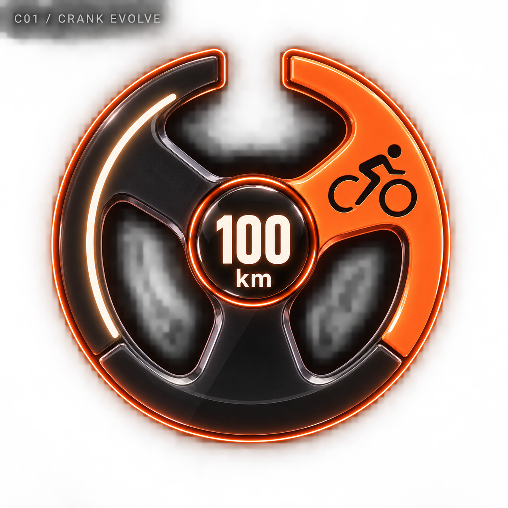
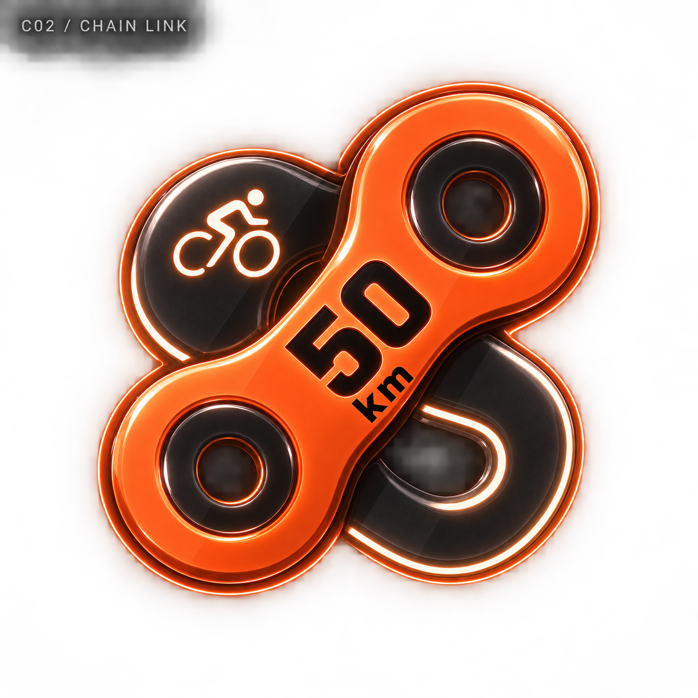
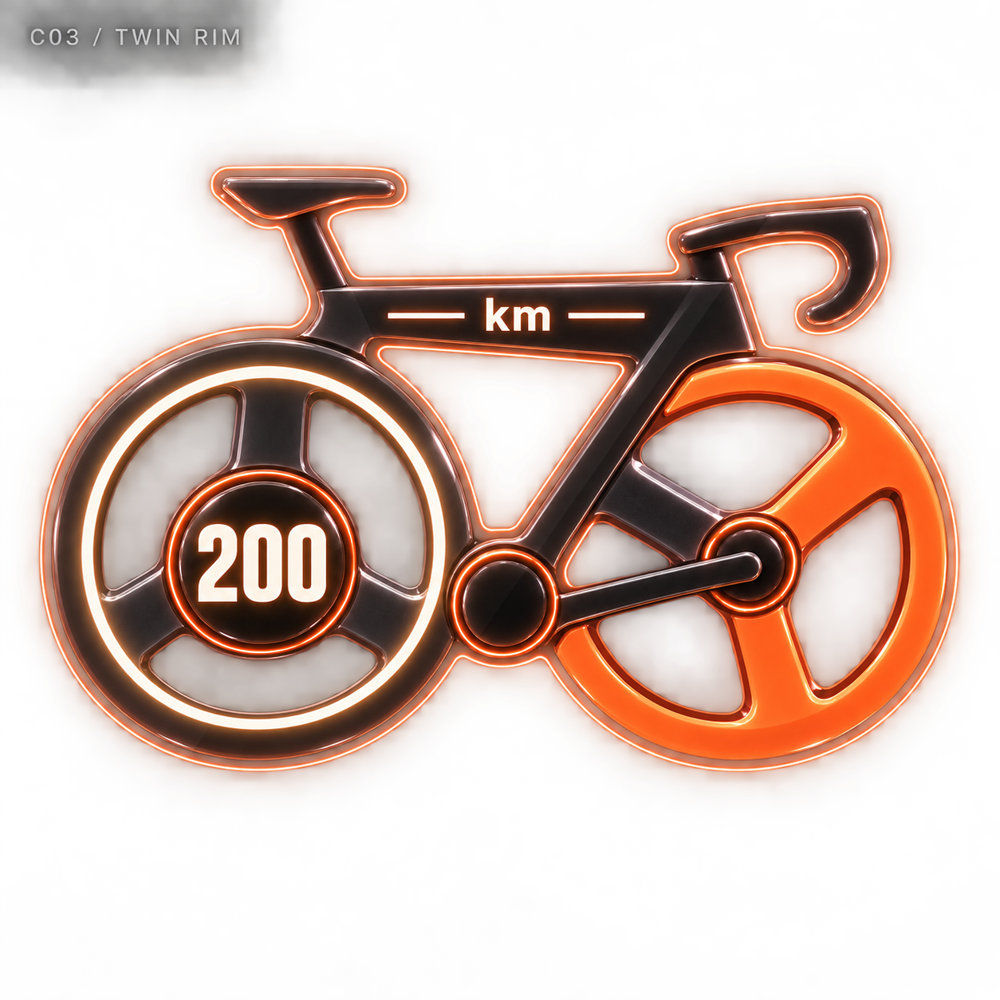
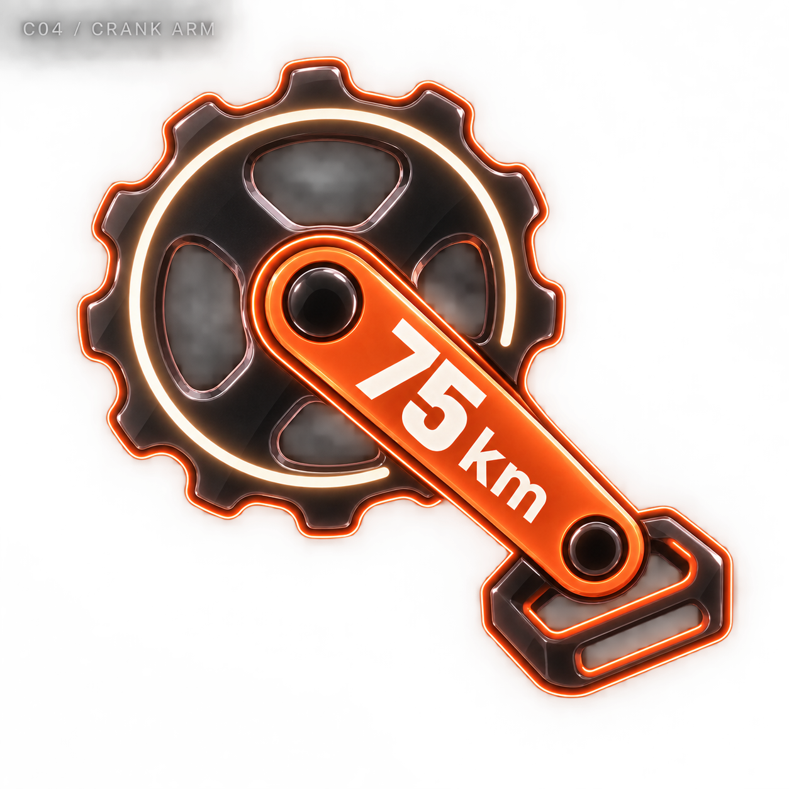
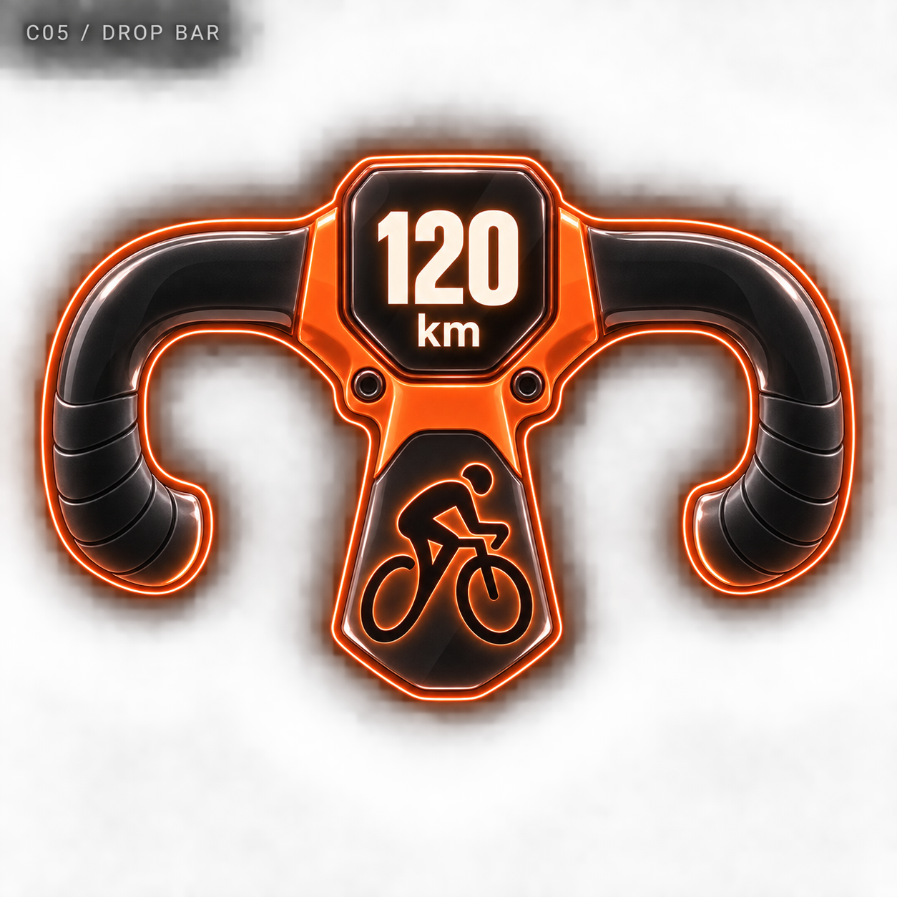
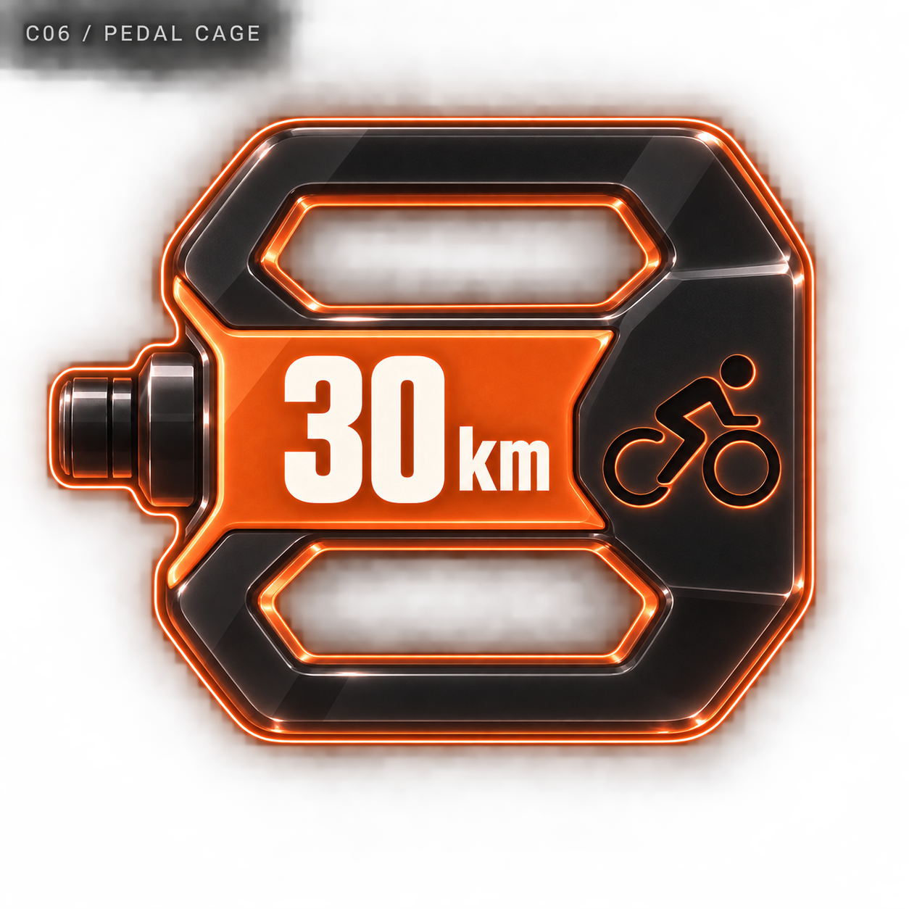
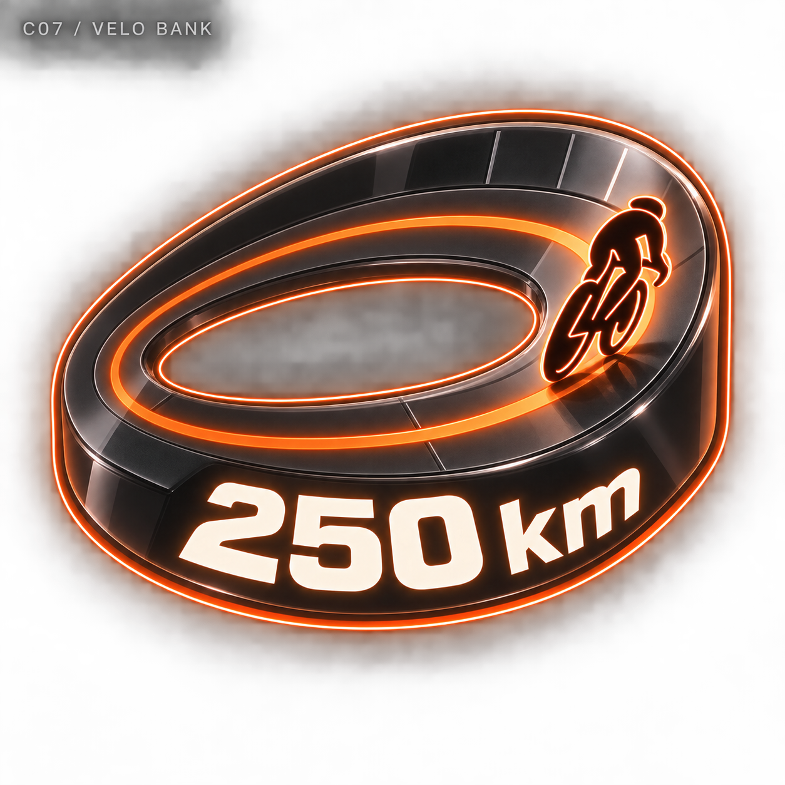
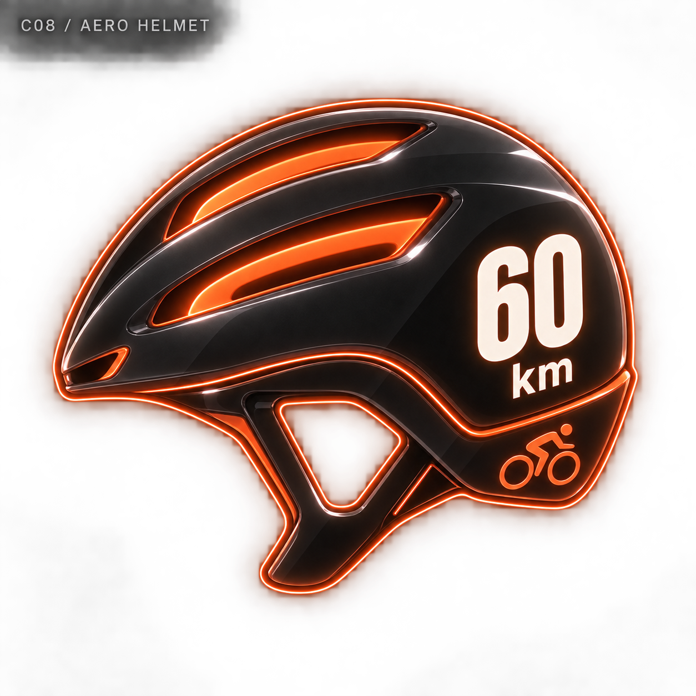
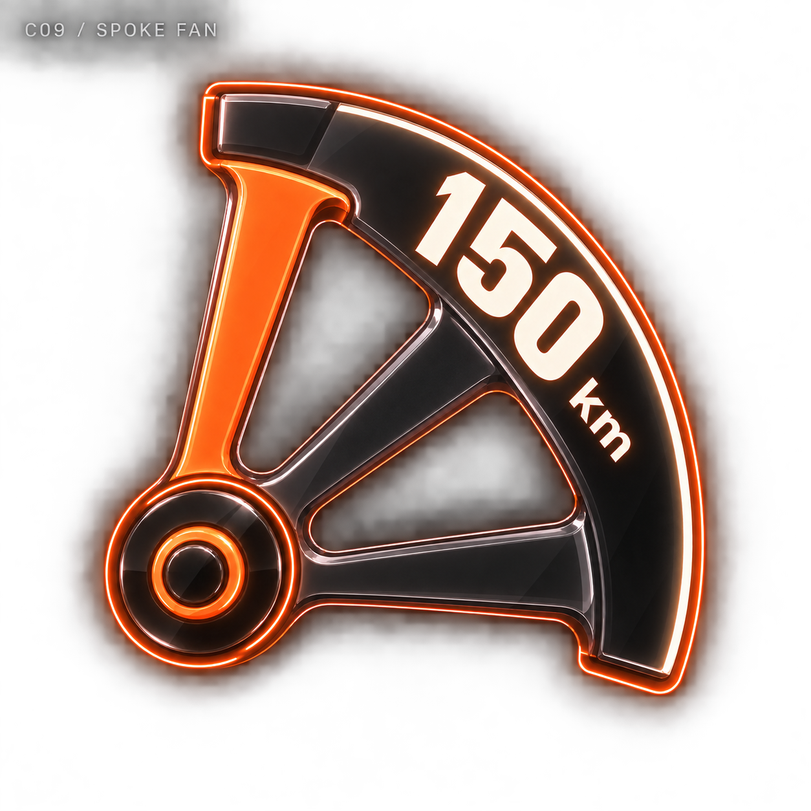
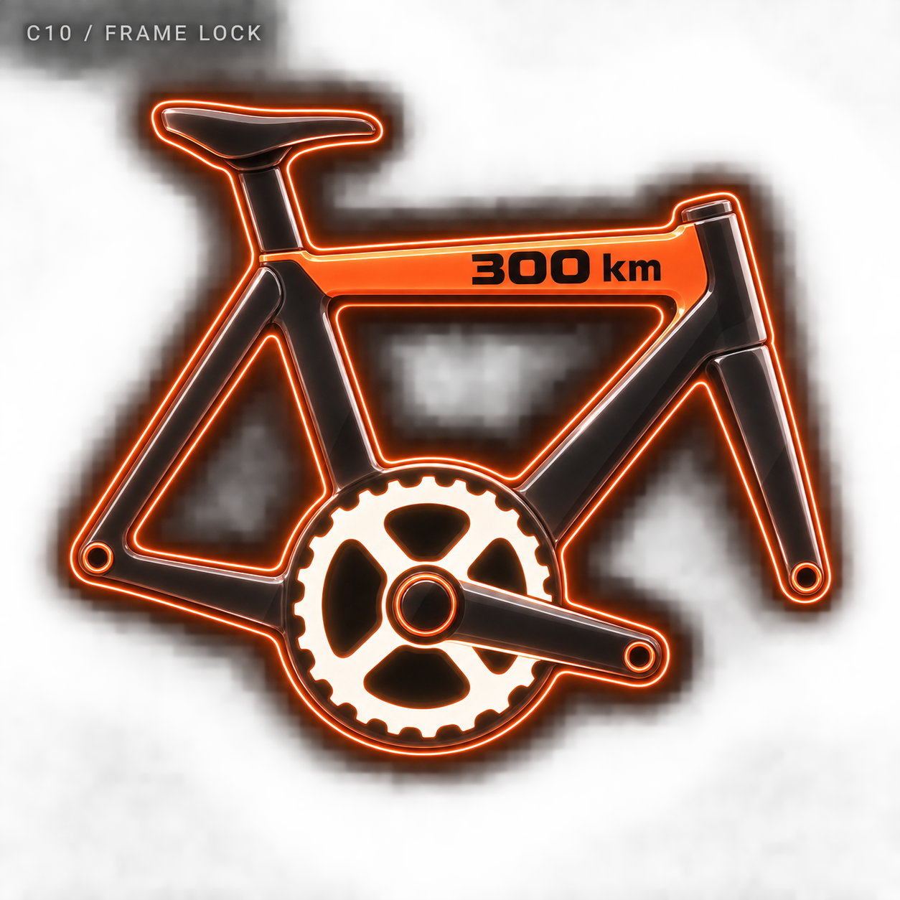

# 사이클 네온 메달 — 10개 시안

관리자 디자인 보관함에 추가한 비교용 시안입니다. 기록 수치는 가상 예시이며 실제 메달 지급에는 적용하지 않았습니다.

[전체 종목으로](../README.md) · [생성 프롬프트](../prompts.json)

## C01 · 크랭크 이볼브 / CRANK EVOLVE

기록 예시: 100 km

[원본 열기](c01-crank-evolve.png)

## C02 · 체인 링크 / CHAIN LINK

기록 예시: 50 km

[원본 열기](c02-chain-link.png)

## C03 · 트윈 림 / TWIN RIM

기록 예시: 200 km

[원본 열기](c03-twin-rim.png)

## C04 · 크랭크 암 / CRANK ARM

기록 예시: 75 km

[원본 열기](c04-crank-arm.png)

## C05 · 드롭 바 / DROP BAR

기록 예시: 120 km

[원본 열기](c05-drop-bar.png)

## C06 · 페달 케이지 / PEDAL CAGE

기록 예시: 30 km

[원본 열기](c06-pedal-cage.png)

## C07 · 벨로 뱅크 / VELO BANK

기록 예시: 250 km

[원본 열기](c07-velo-bank.png)

## C08 · 에어로 헬멧 / AERO HELMET

기록 예시: 60 km

[원본 열기](c08-aero-helmet.png)

## C09 · 스포크 팬 / SPOKE FAN

기록 예시: 150 km

[원본 열기](c09-spoke-fan.png)

## C10 · 프레임 락 / FRAME LOCK

기록 예시: 300 km

[원본 열기](c10-frame-lock.png)
