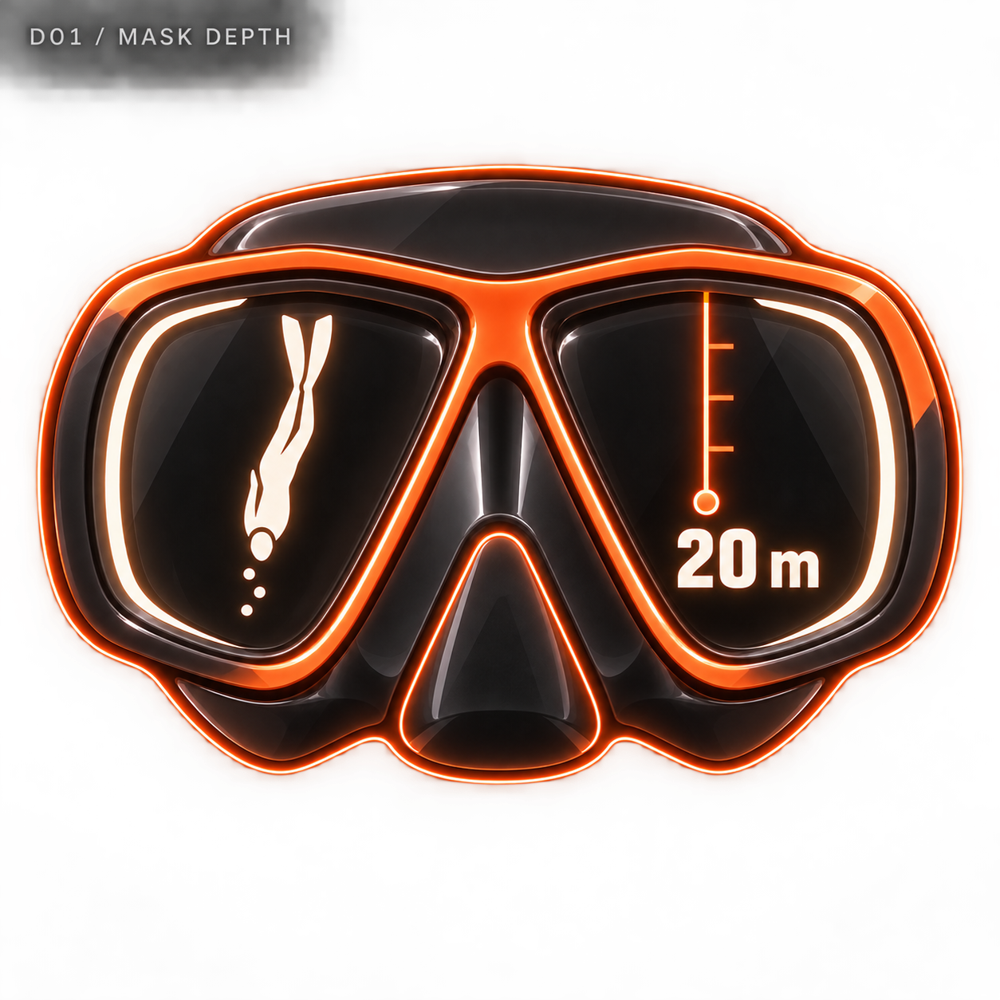
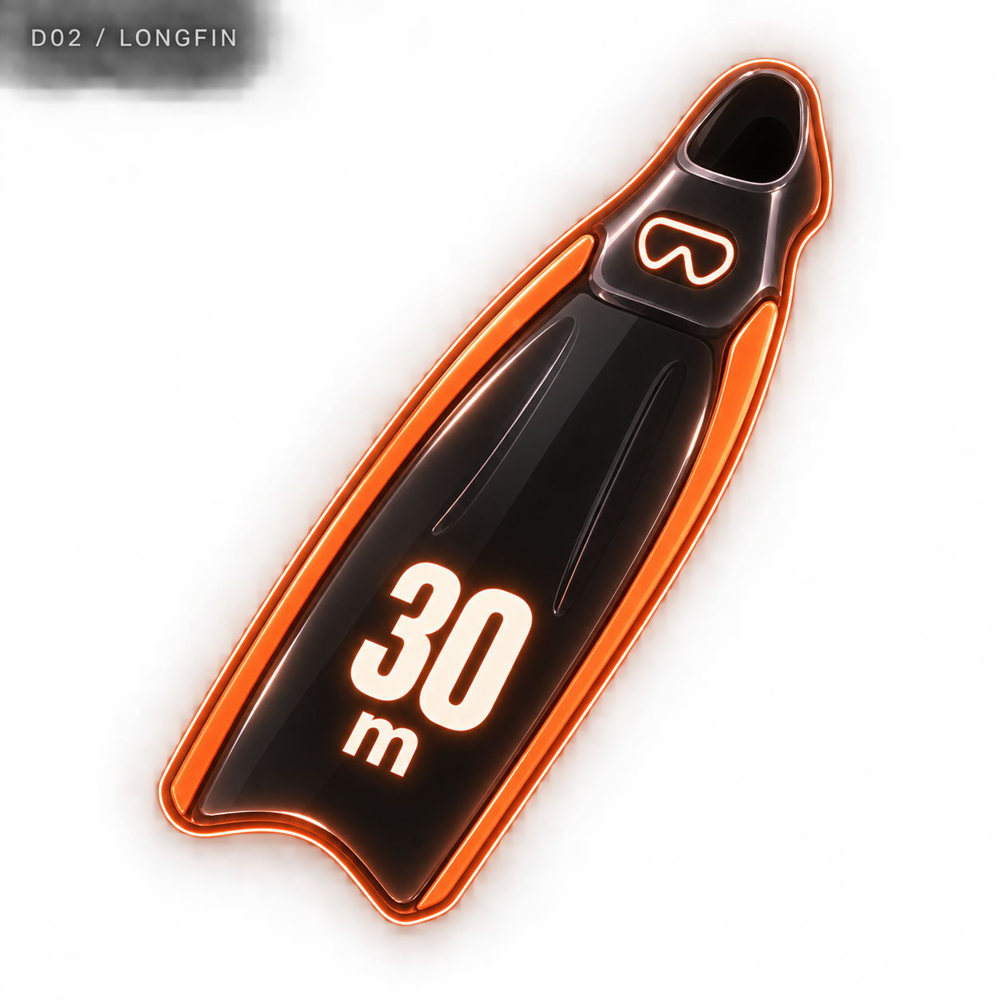
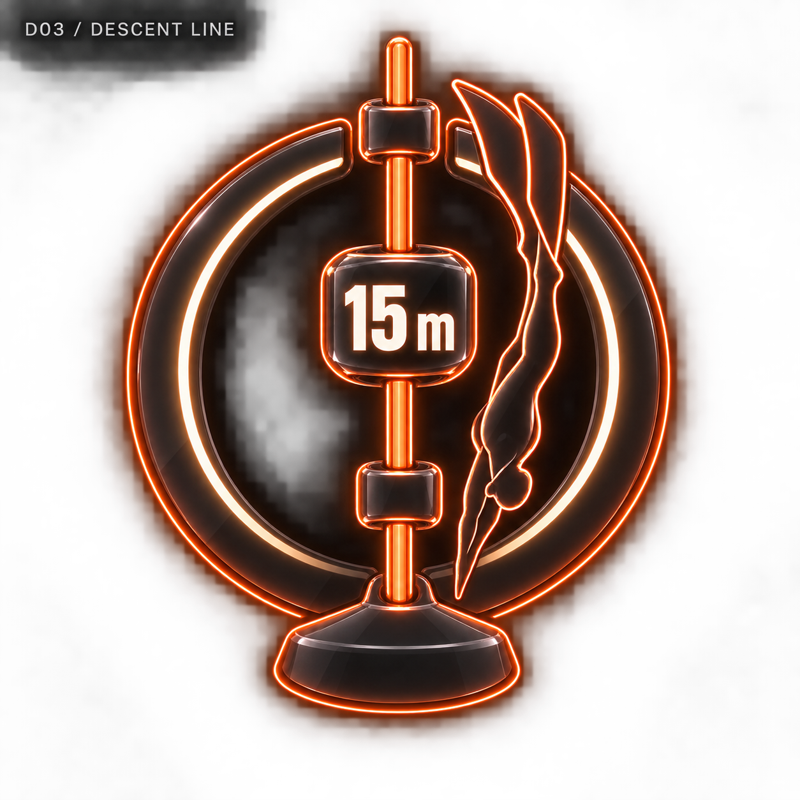
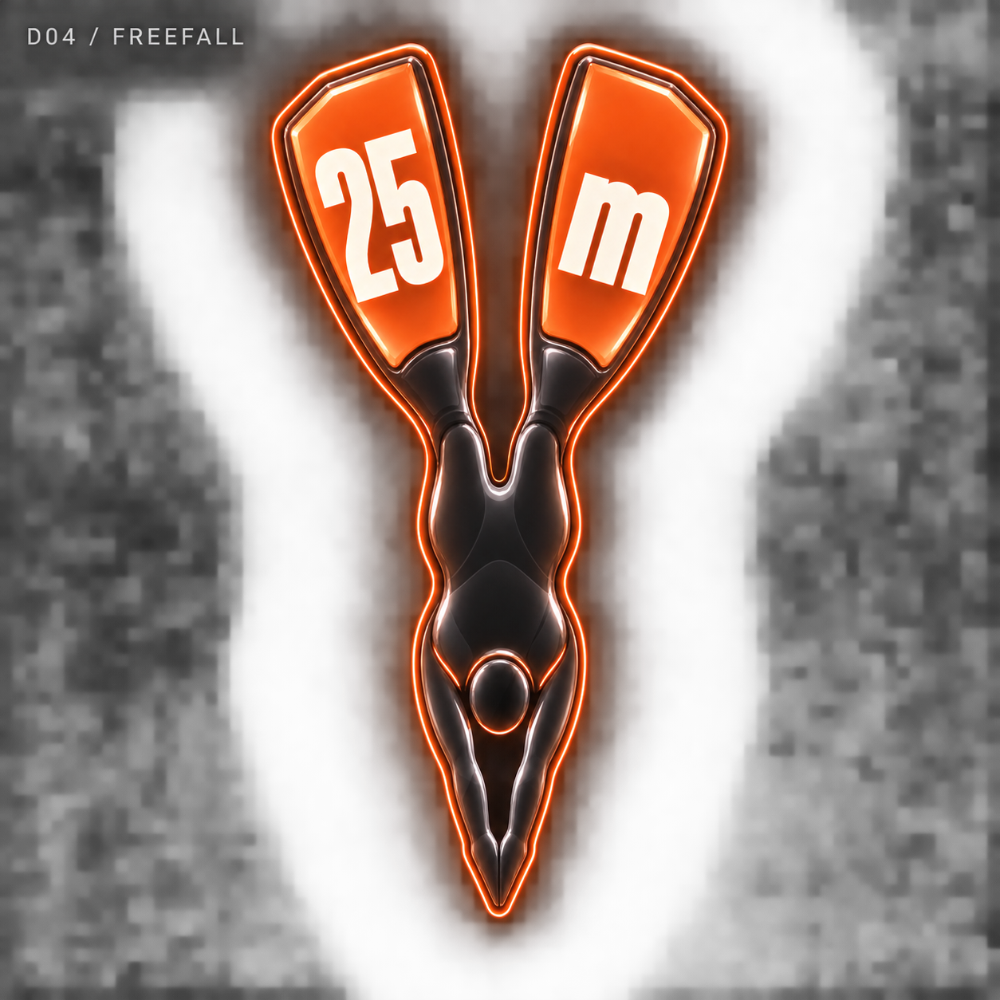
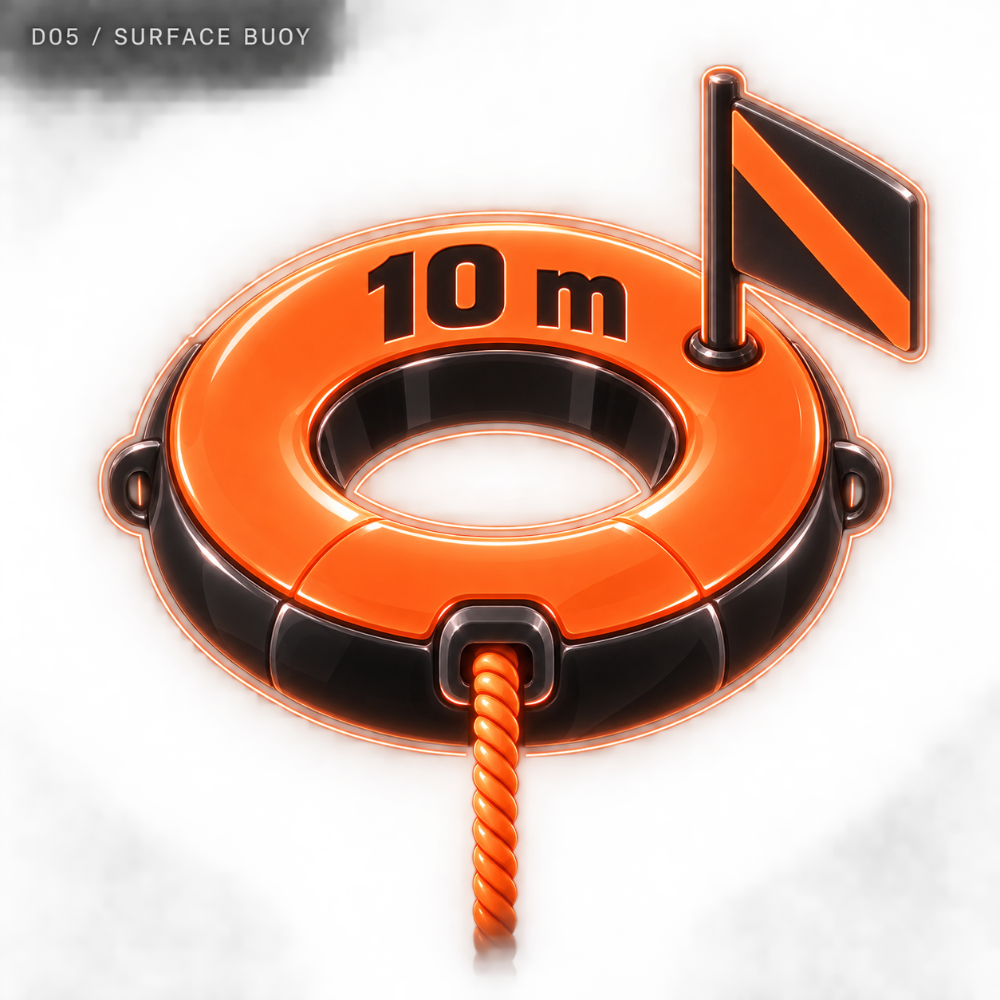
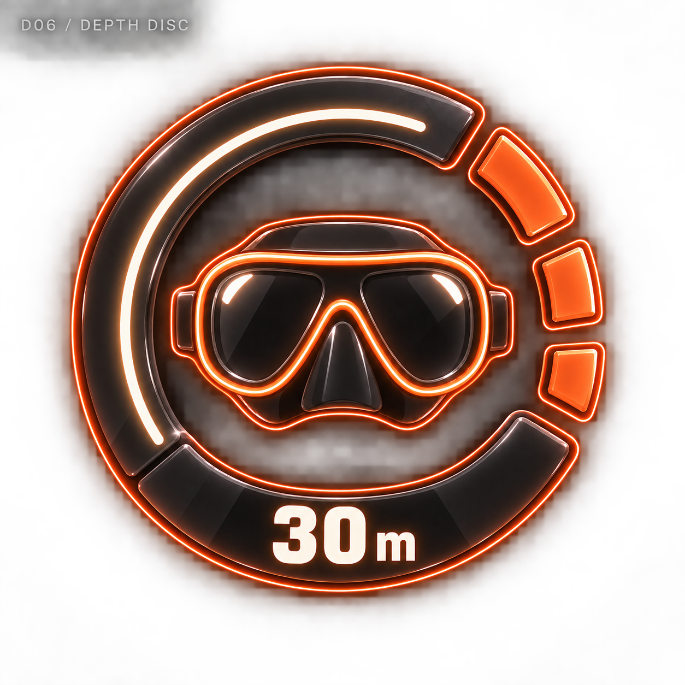
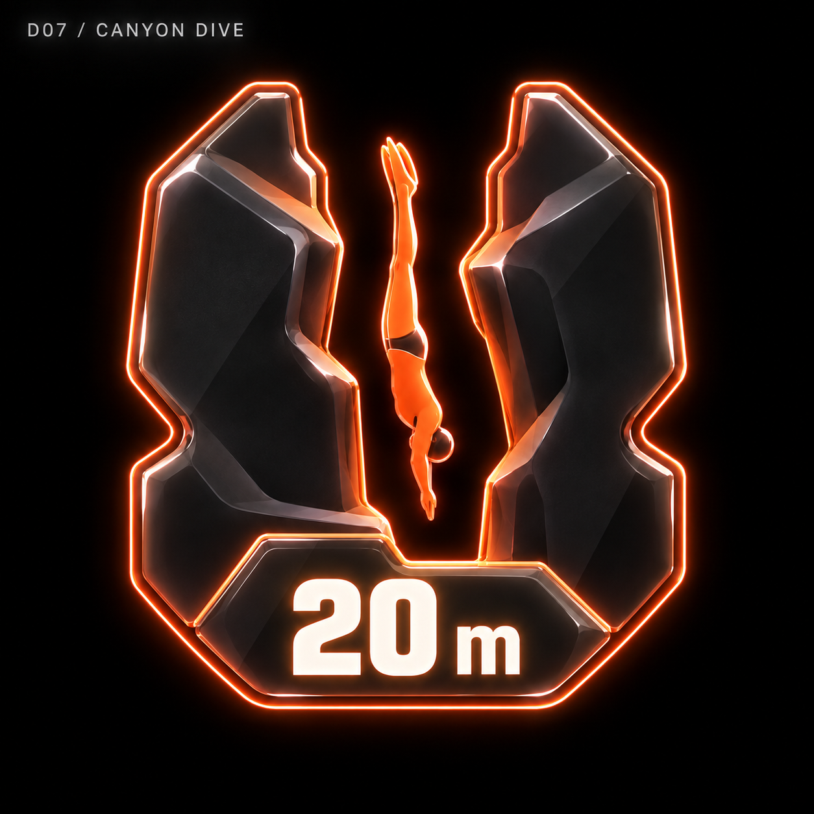
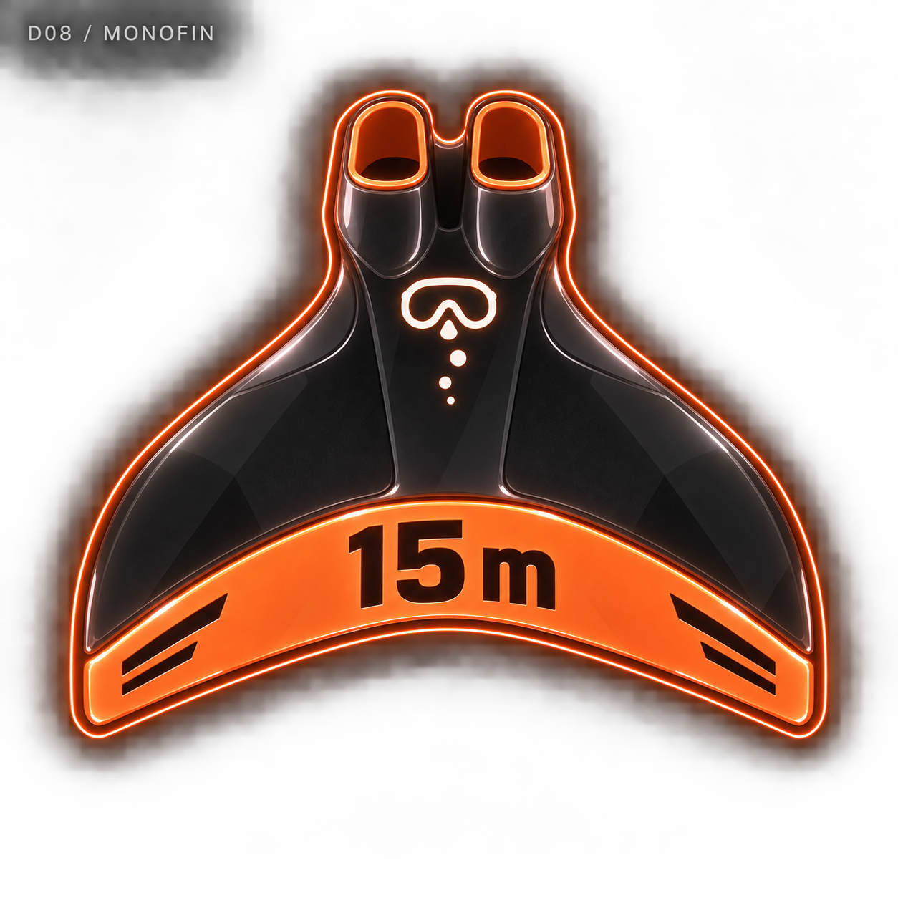
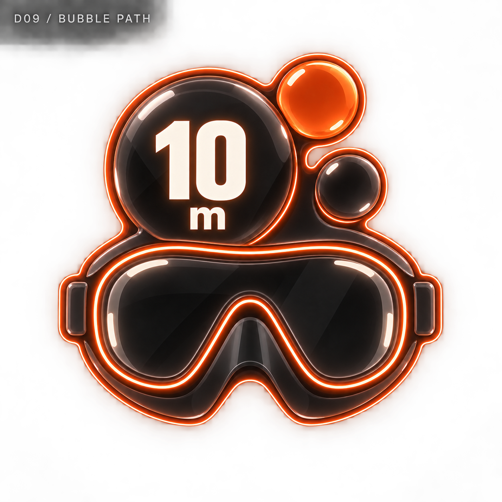
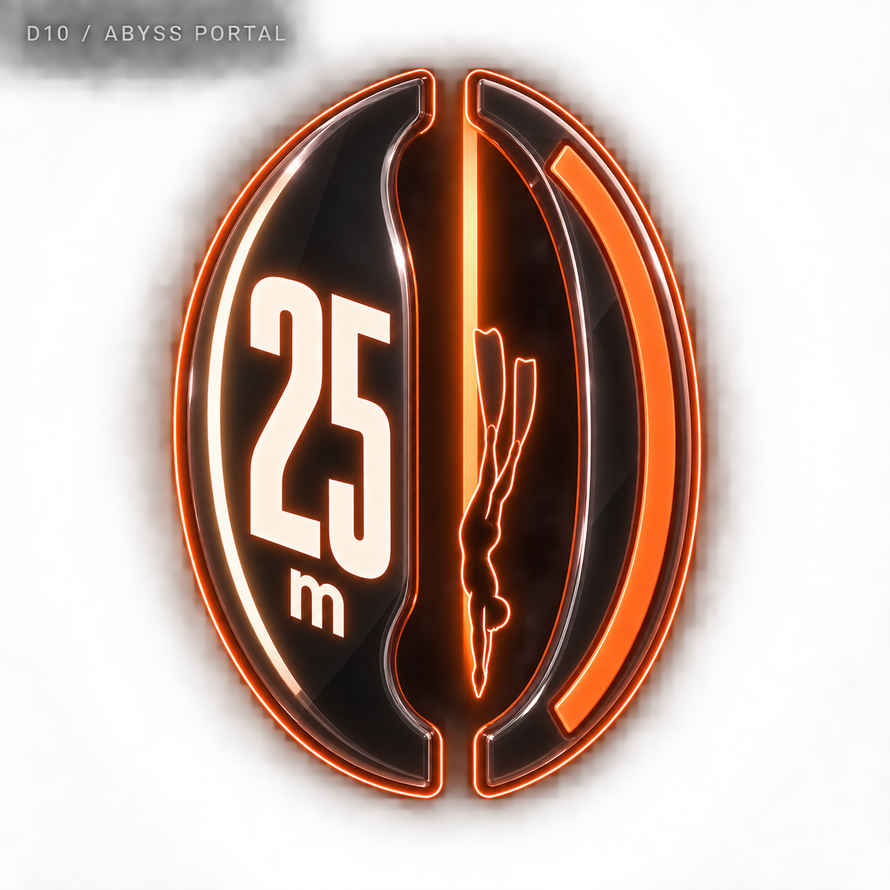

# 다이빙 네온 메달 — 10개 시안

관리자 디자인 보관함에 추가한 비교용 시안입니다. 기록 수치는 가상 예시이며 실제 메달 지급에는 적용하지 않았습니다.

[전체 종목으로](../README.md) · [생성 프롬프트](../prompts.json)

## D01 · 마스크 뎁스 / MASK DEPTH

기록 예시: 20 m

[원본 열기](d01-mask-depth.png)

## D02 · 롱핀 / LONGFIN

기록 예시: 30 m

[원본 열기](d02-longfin.png)

## D03 · 디센트 라인 / DESCENT LINE

기록 예시: 15 m

[원본 열기](d03-descent-line.png)

## D04 · 프리폴 / FREEFALL

기록 예시: 25 m

[원본 열기](d04-freefall.png)

## D05 · 서피스 부이 / SURFACE BUOY

기록 예시: 10 m

[원본 열기](d05-surface-buoy.png)

## D06 · 뎁스 디스크 / DEPTH DISC

기록 예시: 30 m

[원본 열기](d06-depth-disc.png)

## D07 · 캐니언 다이브 / CANYON DIVE

기록 예시: 20 m

[원본 열기](d07-canyon-dive.png)

## D08 · 모노핀 / MONOFIN

기록 예시: 15 m

[원본 열기](d08-monofin.png)

## D09 · 버블 패스 / BUBBLE PATH

기록 예시: 10 m

[원본 열기](d09-bubble-path.png)

## D10 · 어비스 포털 / ABYSS PORTAL

기록 예시: 25 m

[원본 열기](d10-abyss-portal.png)
