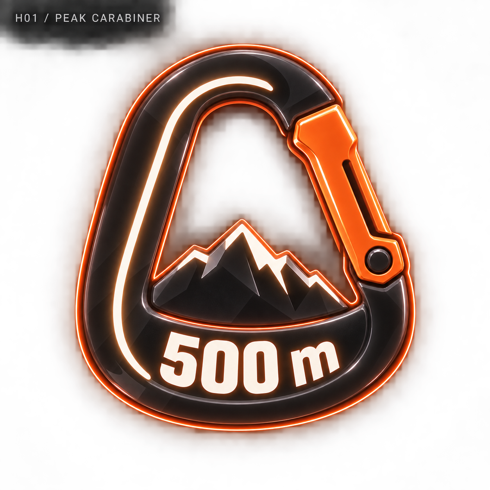
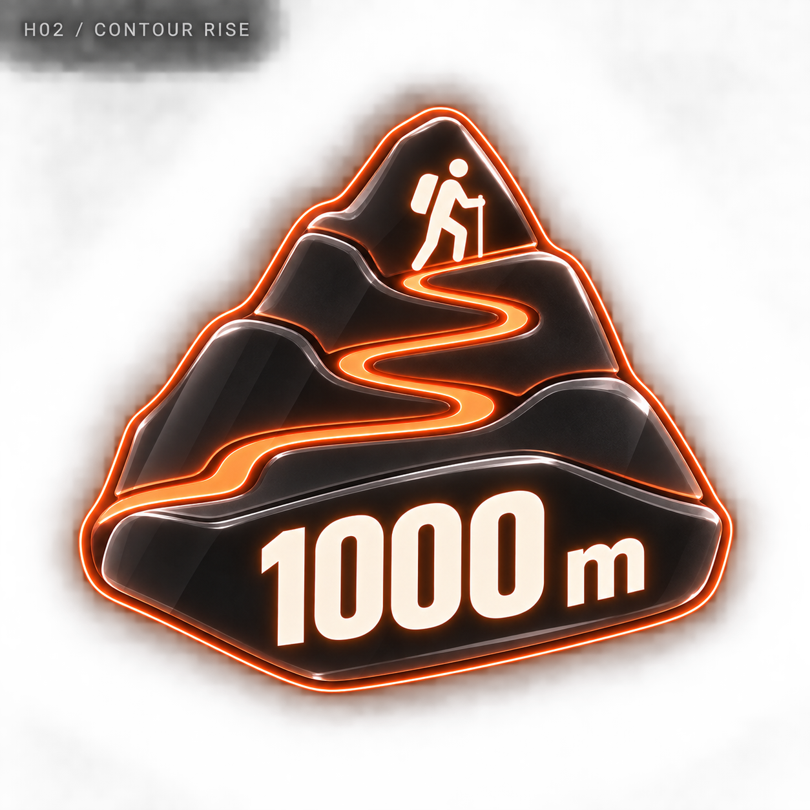
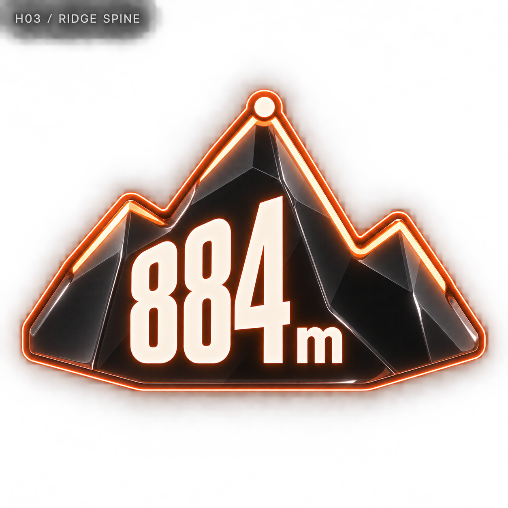
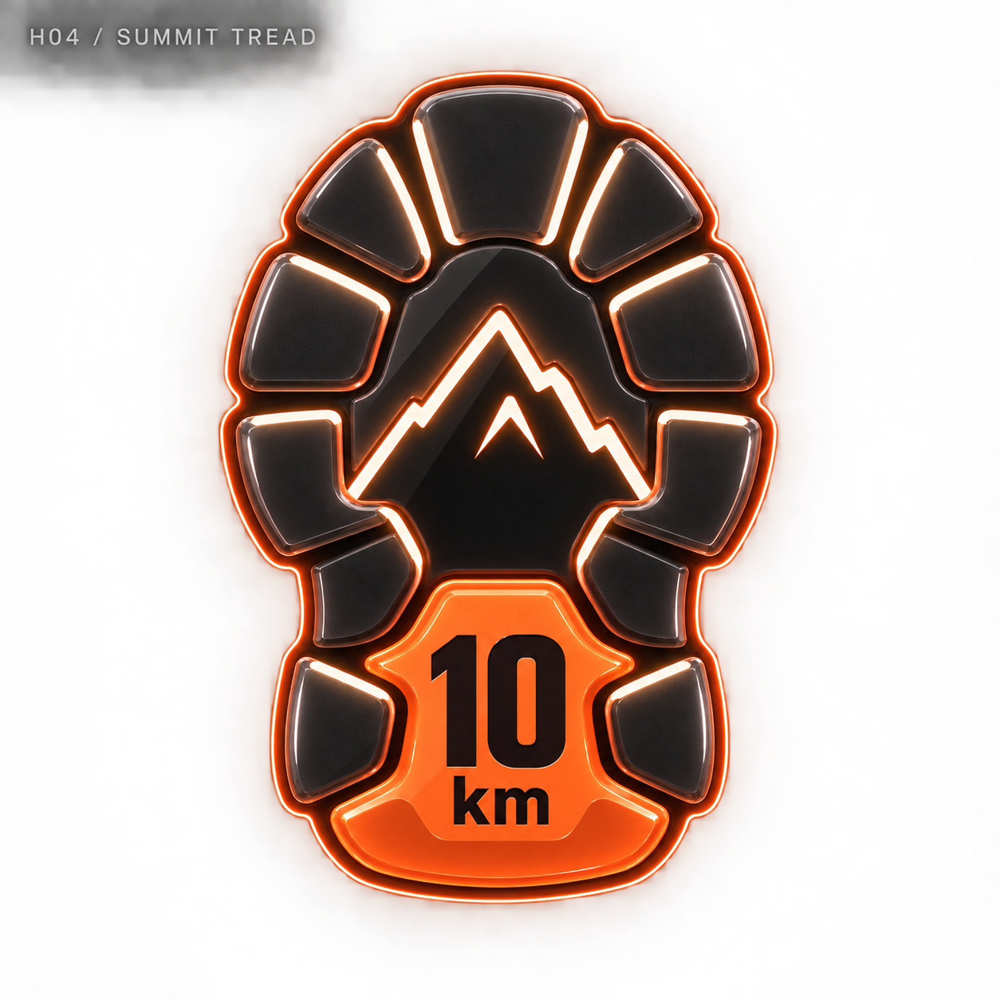
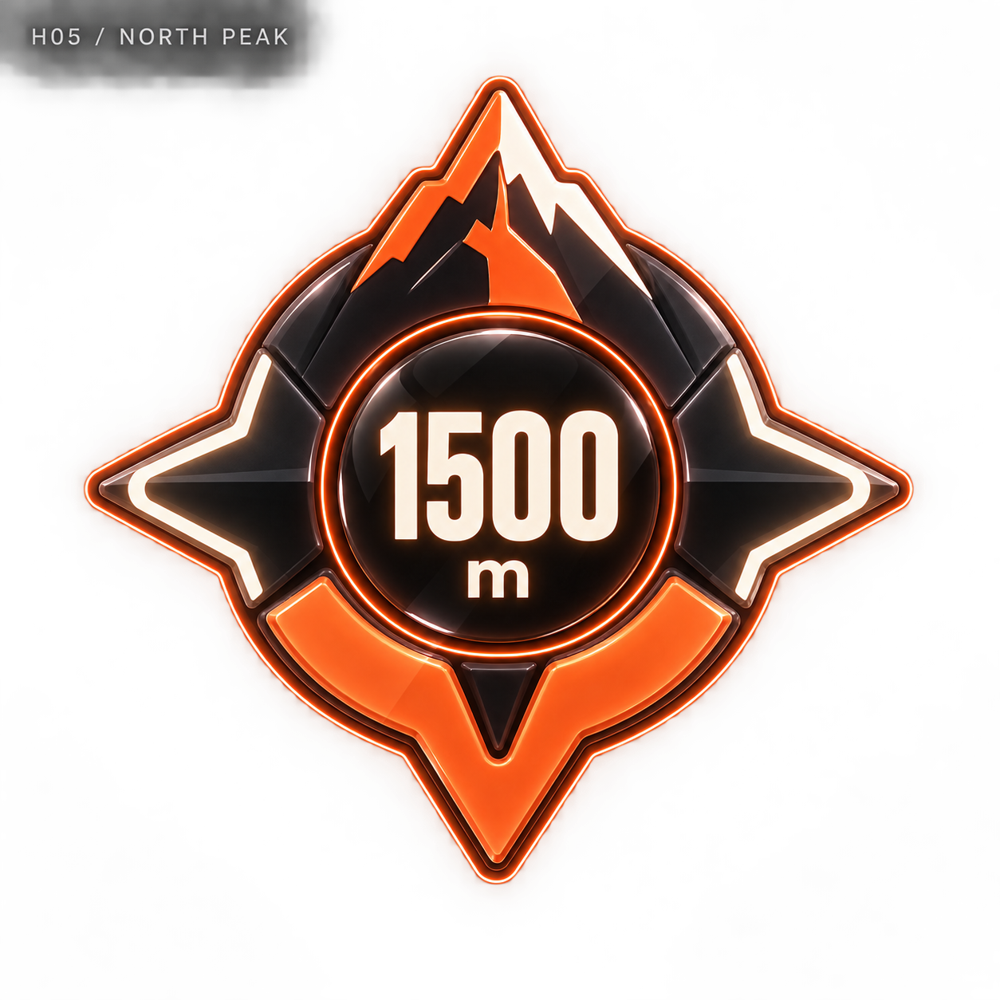
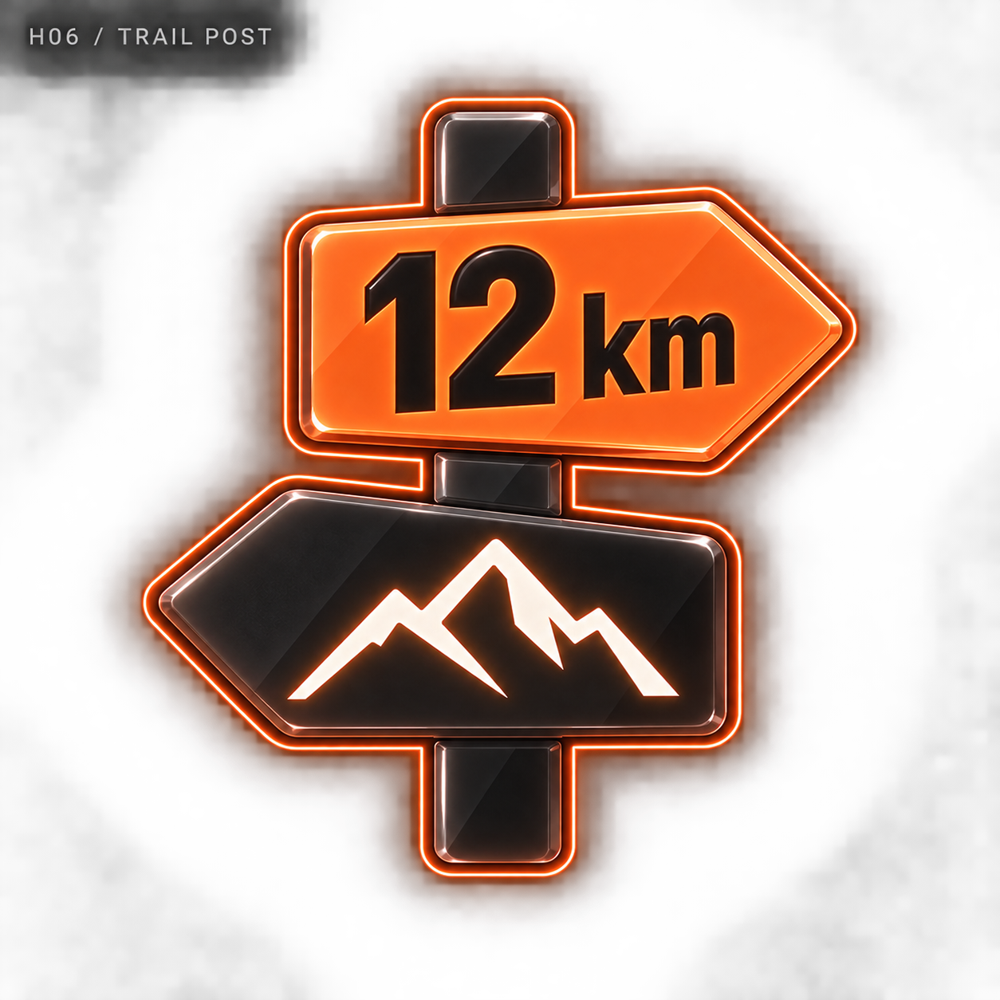
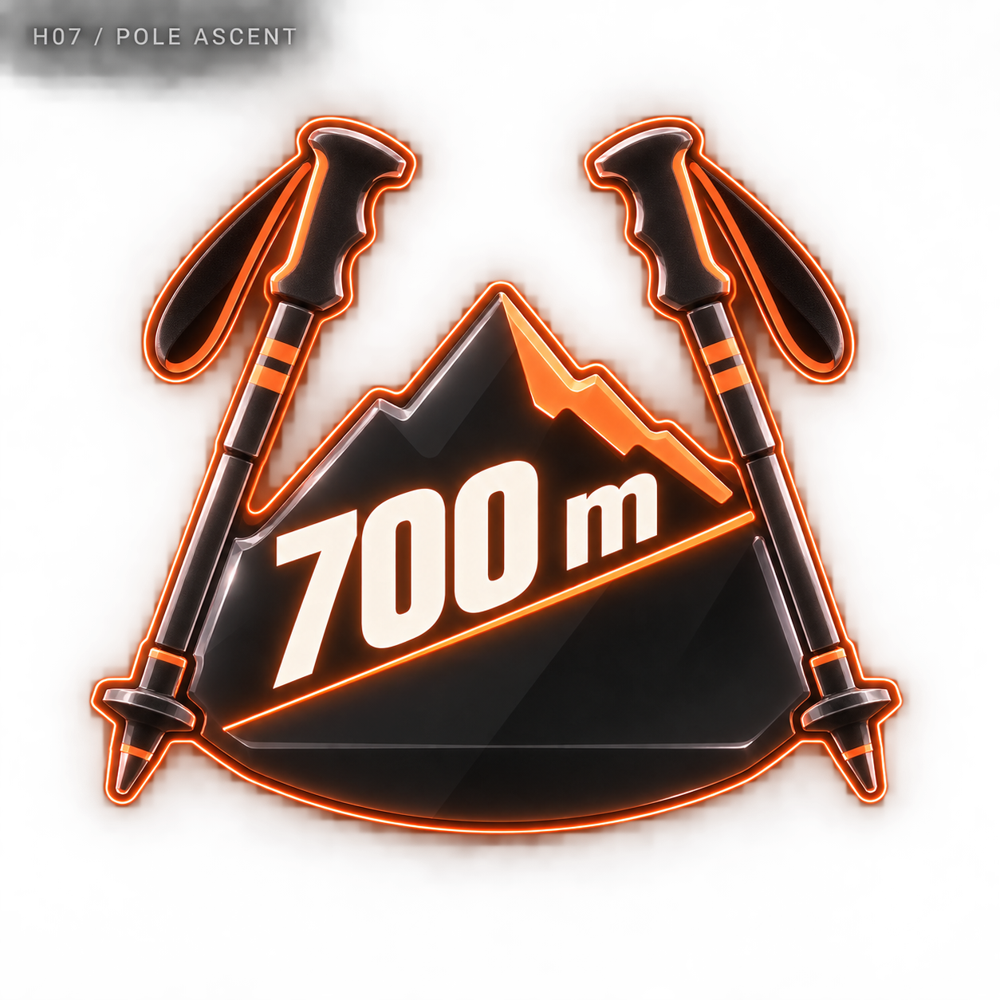
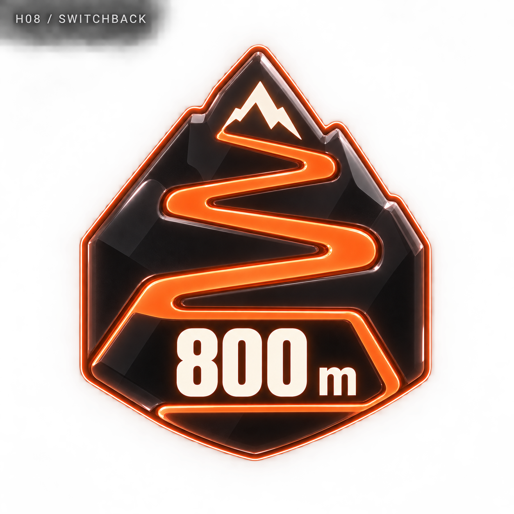
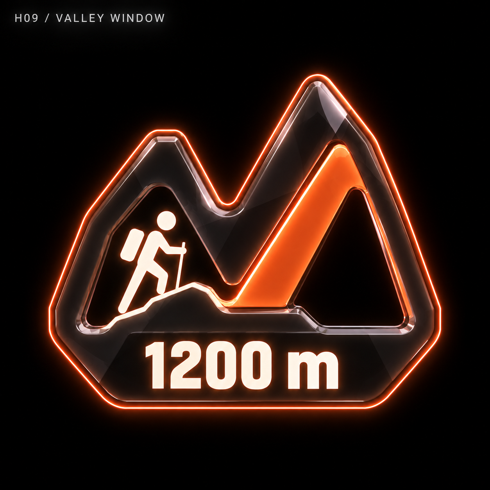
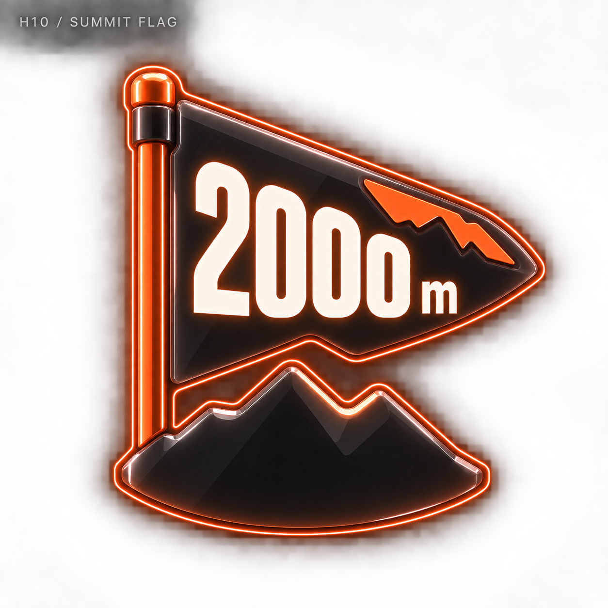

# 등산 네온 메달 — 10개 시안

관리자 디자인 보관함에 추가한 비교용 시안입니다. 기록 수치는 가상 예시이며 실제 메달 지급에는 적용하지 않았습니다.

[전체 종목으로](../README.md) · [생성 프롬프트](../prompts.json)

## H01 · 피크 카라비너 / PEAK CARABINER

기록 예시: 500 m

[원본 열기](h01-peak-carabiner.png)

## H02 · 컨투어 라이즈 / CONTOUR RISE

기록 예시: 1000 m

[원본 열기](h02-contour-rise.png)

## H03 · 리지 스파인 / RIDGE SPINE

기록 예시: 884 m

[원본 열기](h03-ridge-spine.png)

## H04 · 서밋 트레드 / SUMMIT TREAD

기록 예시: 10 km

[원본 열기](h04-summit-tread.png)

## H05 · 노스 피크 / NORTH PEAK

기록 예시: 1500 m

[원본 열기](h05-north-peak.png)

## H06 · 트레일 포스트 / TRAIL POST

기록 예시: 12 km

[원본 열기](h06-trail-post.png)

## H07 · 폴 어센트 / POLE ASCENT

기록 예시: 700 m

[원본 열기](h07-pole-ascent.png)

## H08 · 스위치백 / SWITCHBACK

기록 예시: 800 m

[원본 열기](h08-switchback.png)

## H09 · 밸리 윈도 / VALLEY WINDOW

기록 예시: 1200 m

[원본 열기](h09-valley-window.png)

## H10 · 서밋 플래그 / SUMMIT FLAG

기록 예시: 2000 m

[원본 열기](h10-summit-flag.png)
