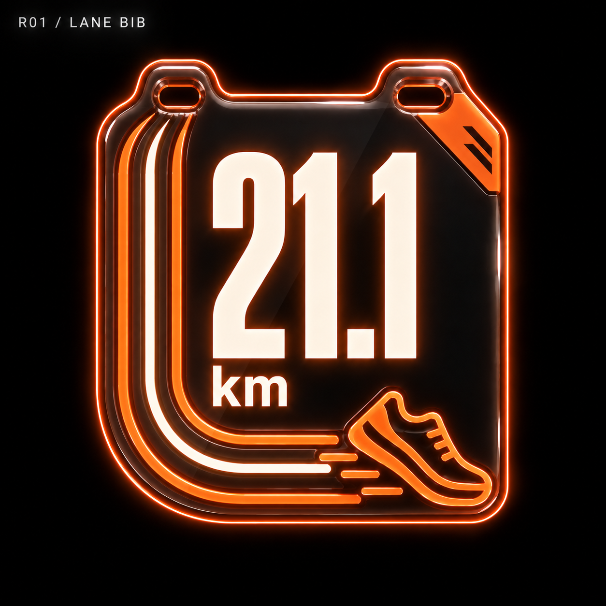
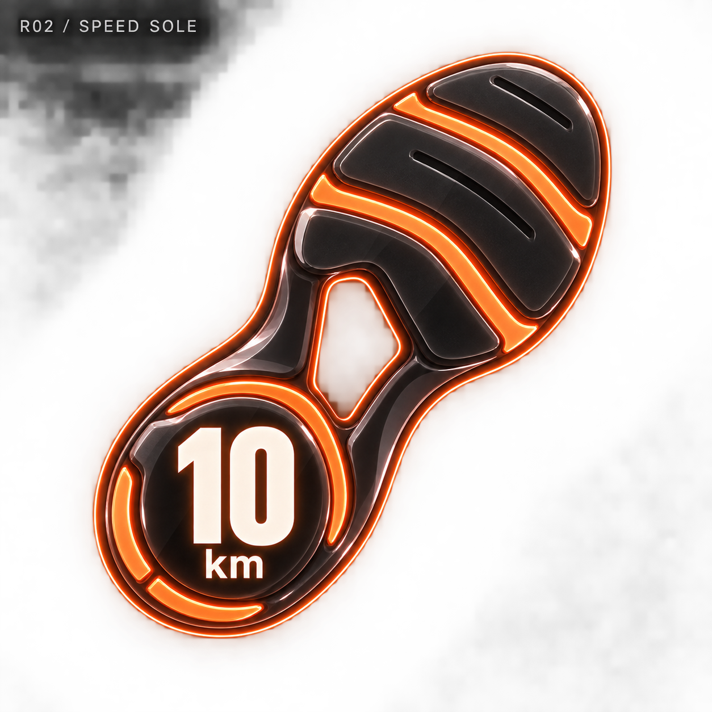
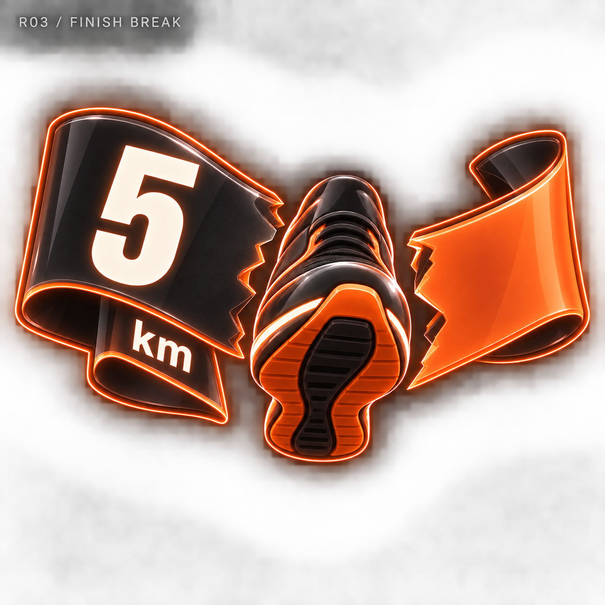
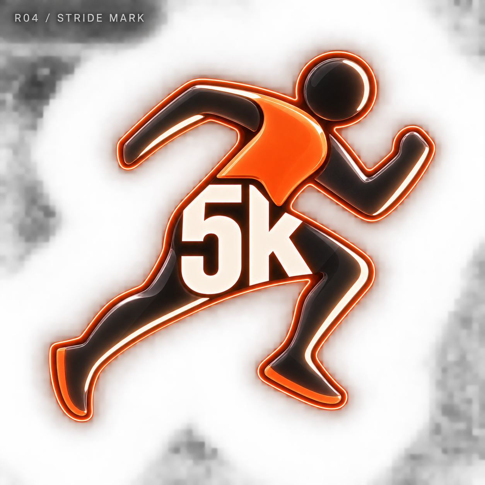
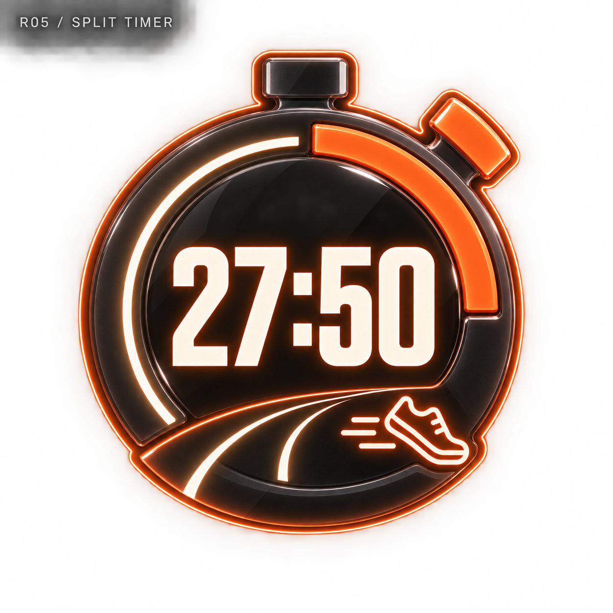
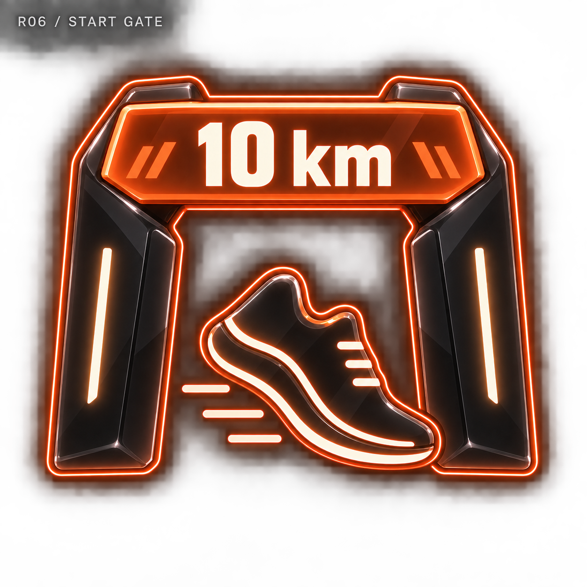
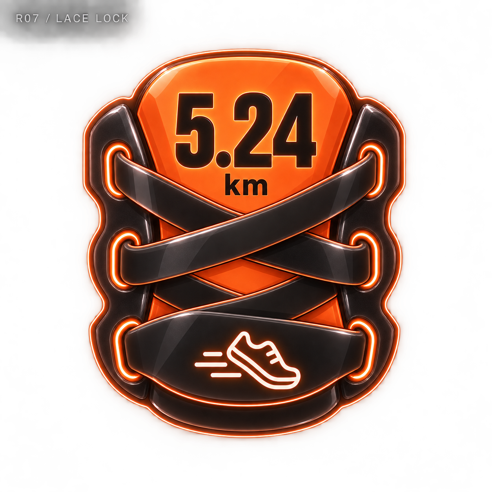
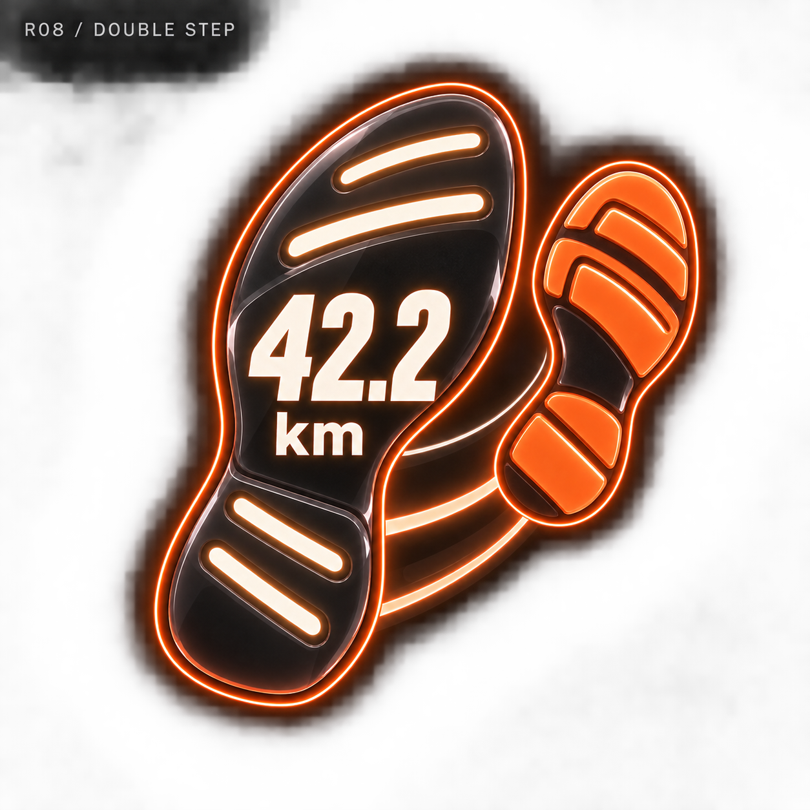
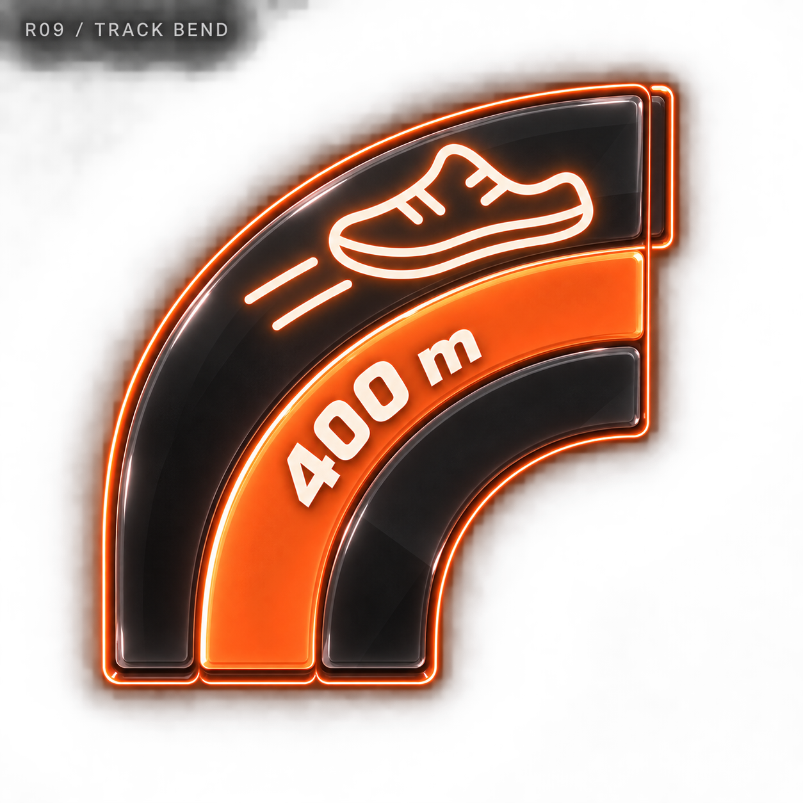
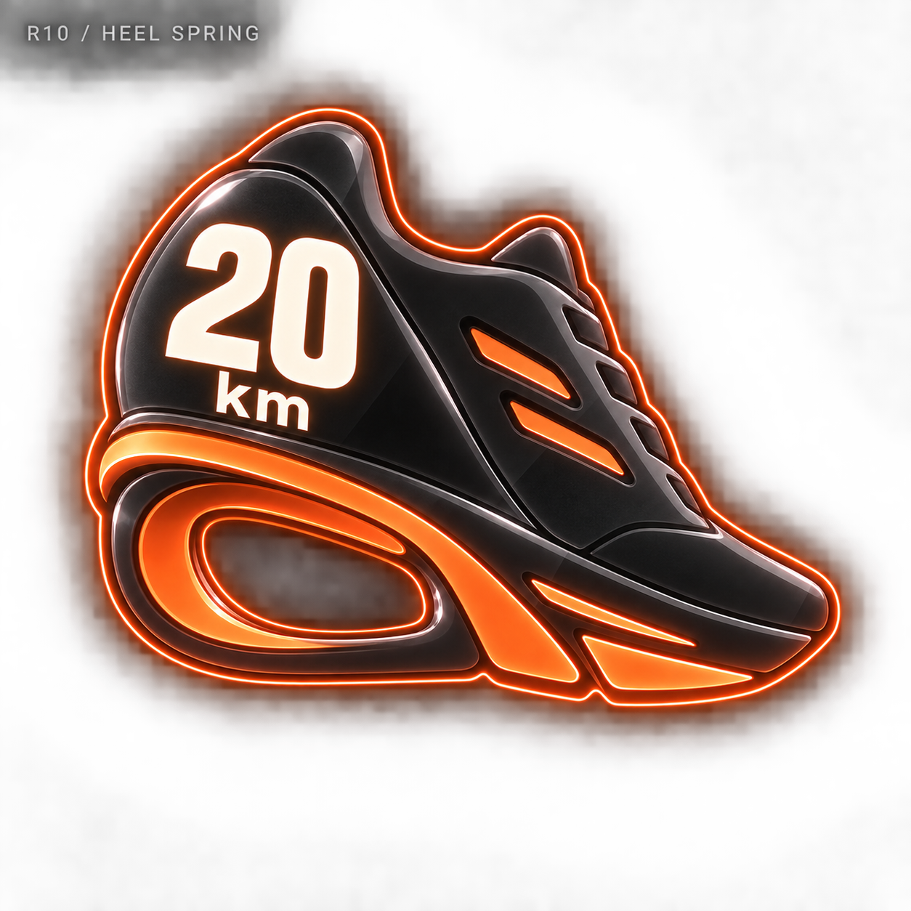

# 러닝 네온 메달 — 10개 시안

관리자 디자인 보관함에 추가한 비교용 시안입니다. 기록 수치는 가상 예시이며 실제 메달 지급에는 적용하지 않았습니다.

[전체 종목으로](../README.md) · [생성 프롬프트](../prompts.json)

## R01 · 레인 빕 / LANE BIB

기록 예시: 21.1 km

[원본 열기](r01-lane-bib.png)

## R02 · 스피드 솔 / SPEED SOLE

기록 예시: 10 km

[원본 열기](r02-speed-sole.png)

## R03 · 피니시 브레이크 / FINISH BREAK

기록 예시: 5 km

[원본 열기](r03-finish-break.png)

## R04 · 스트라이드 마크 / STRIDE MARK

기록 예시: 5K

[원본 열기](r04-stride-mark.png)

## R05 · 스플릿 타이머 / SPLIT TIMER

기록 예시: 27:50

[원본 열기](r05-split-timer.png)

## R06 · 스타트 게이트 / START GATE

기록 예시: 10 km

[원본 열기](r06-start-gate.png)

## R07 · 레이스 락 / LACE LOCK

기록 예시: 5.24 km

[원본 열기](r07-lace-lock.png)

## R08 · 더블 스텝 / DOUBLE STEP

기록 예시: 42.2 km

[원본 열기](r08-double-step.png)

## R09 · 트랙 벤드 / TRACK BEND

기록 예시: 400 m

[원본 열기](r09-track-bend.png)

## R10 · 힐 스프링 / HEEL SPRING

기록 예시: 20 km

[원본 열기](r10-heel-spring.png)
