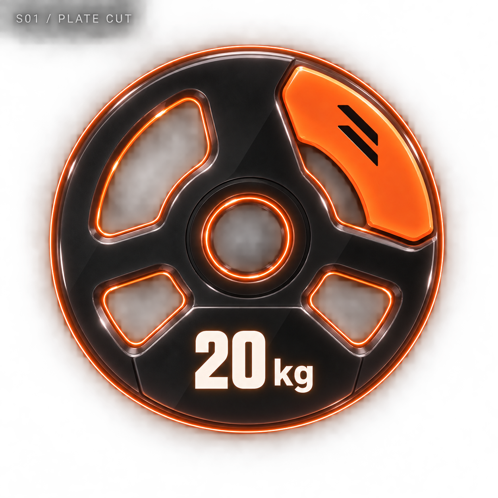
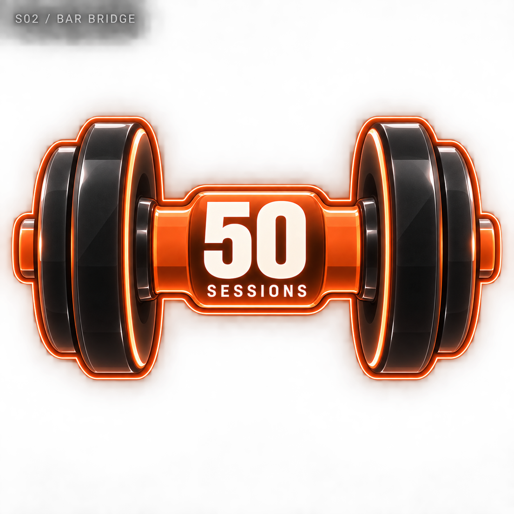
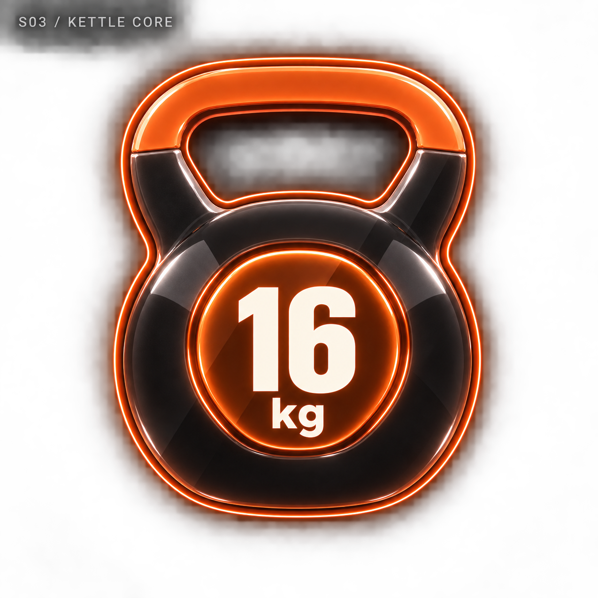
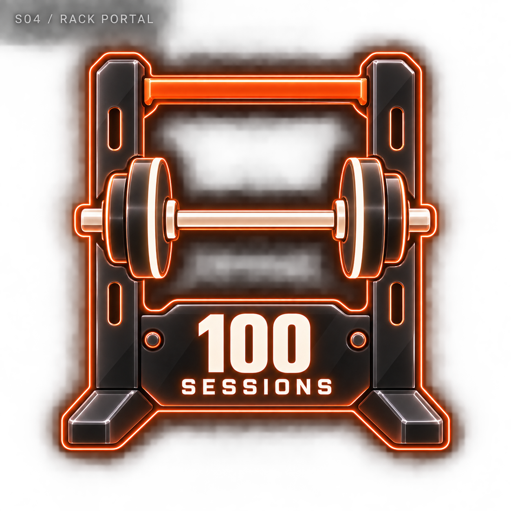
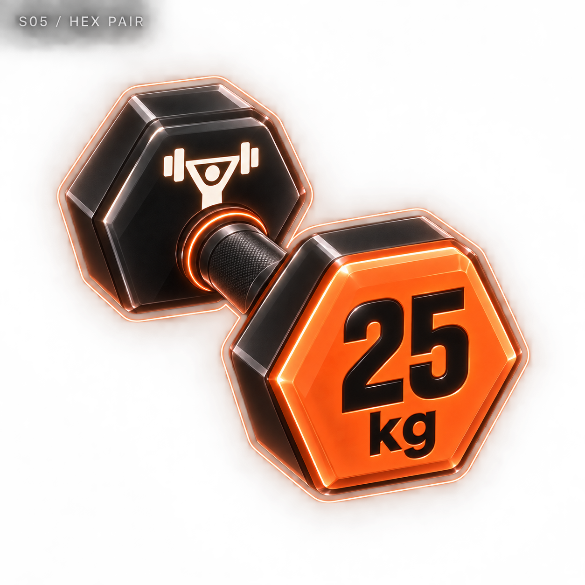
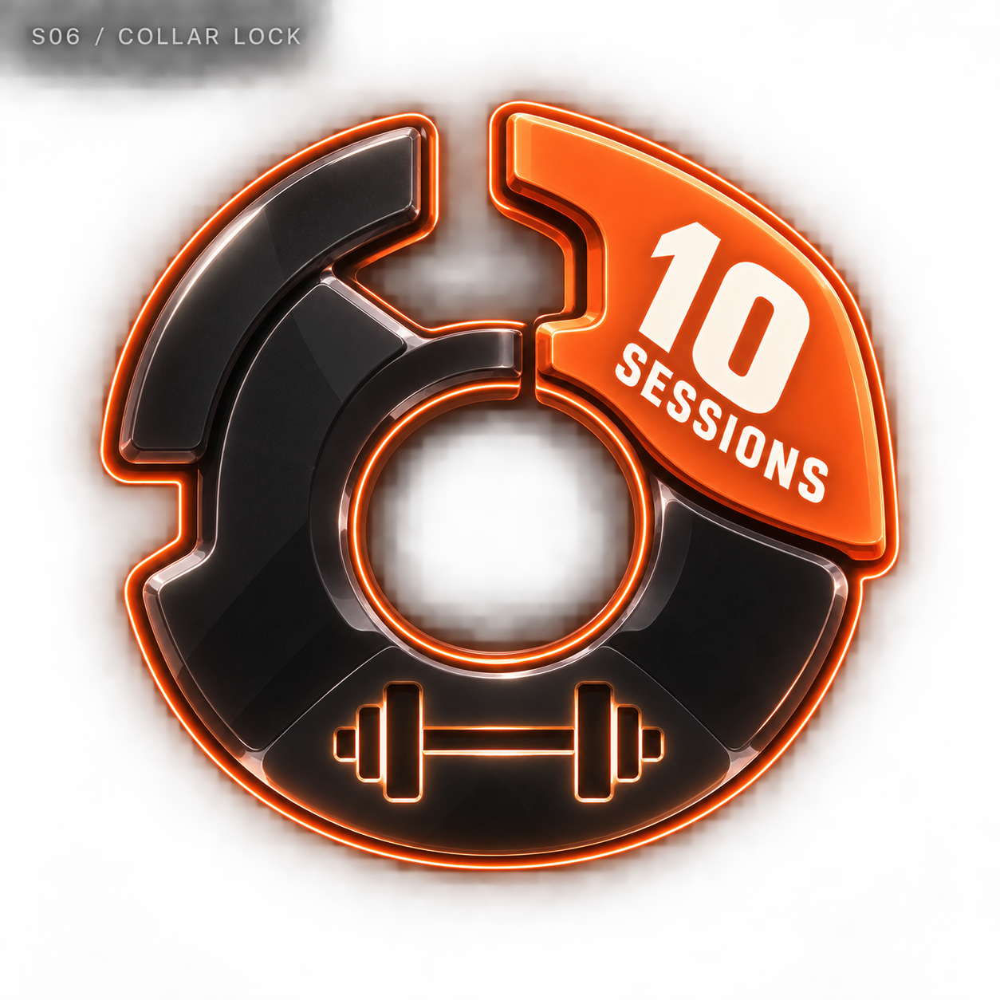
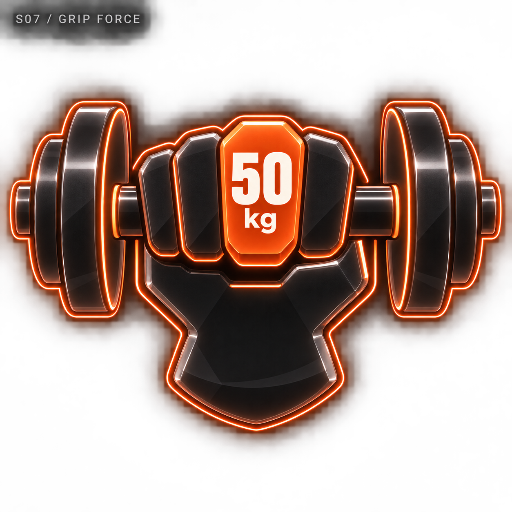
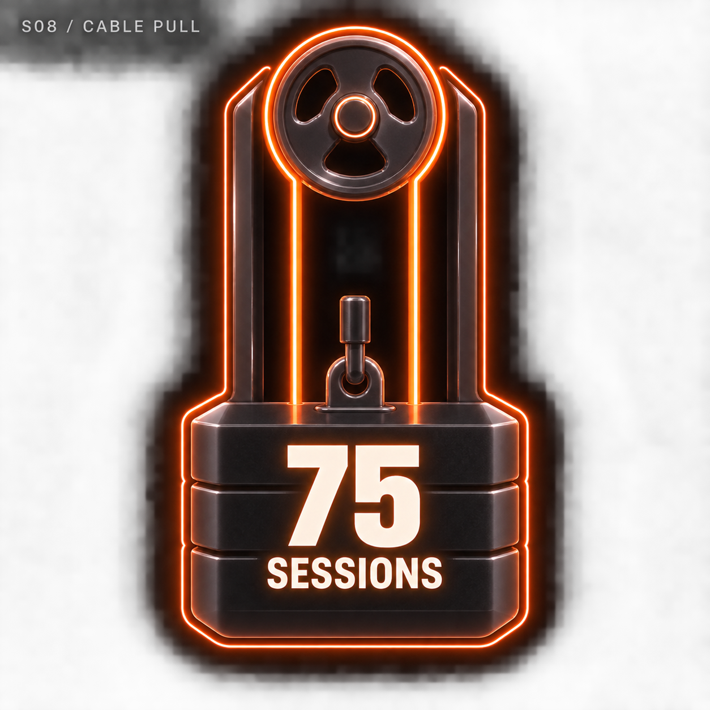
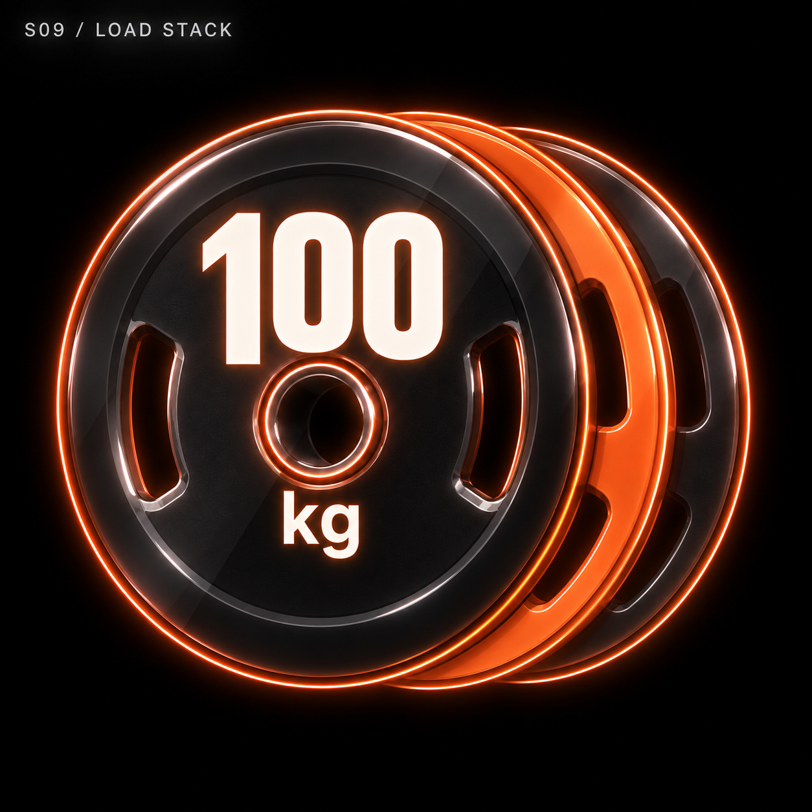
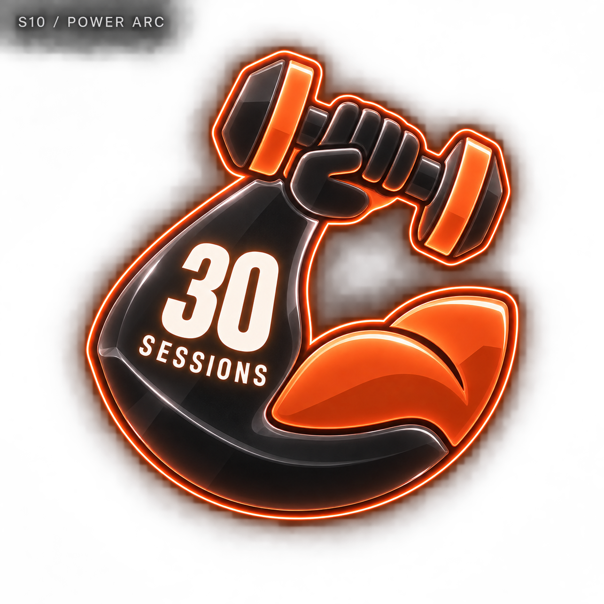

# 근력 네온 메달 — 10개 시안

관리자 디자인 보관함에 추가한 비교용 시안입니다. 기록 수치는 가상 예시이며 실제 메달 지급에는 적용하지 않았습니다.

[전체 종목으로](../README.md) · [생성 프롬프트](../prompts.json)

## S01 · 플레이트 컷 / PLATE CUT

기록 예시: 20 kg

[원본 열기](s01-plate-cut.png)

## S02 · 바 브리지 / BAR BRIDGE

기록 예시: 50 SESSIONS

[원본 열기](s02-bar-bridge.png)

## S03 · 케틀 코어 / KETTLE CORE

기록 예시: 16 kg

[원본 열기](s03-kettle-core.png)

## S04 · 랙 포털 / RACK PORTAL

기록 예시: 100 SESSIONS

[원본 열기](s04-rack-portal.png)

## S05 · 헥스 페어 / HEX PAIR

기록 예시: 25 kg

[원본 열기](s05-hex-pair.png)

## S06 · 칼라 락 / COLLAR LOCK

기록 예시: 10 SESSIONS

[원본 열기](s06-collar-lock.png)

## S07 · 그립 포스 / GRIP FORCE

기록 예시: 50 kg

[원본 열기](s07-grip-force.png)

## S08 · 케이블 풀 / CABLE PULL

기록 예시: 75 SESSIONS

[원본 열기](s08-cable-pull.png)

## S09 · 로드 스택 / LOAD STACK

기록 예시: 100 kg

[원본 열기](s09-load-stack.png)

## S10 · 파워 아크 / POWER ARC

기록 예시: 30 SESSIONS

[원본 열기](s10-power-arc.png)
