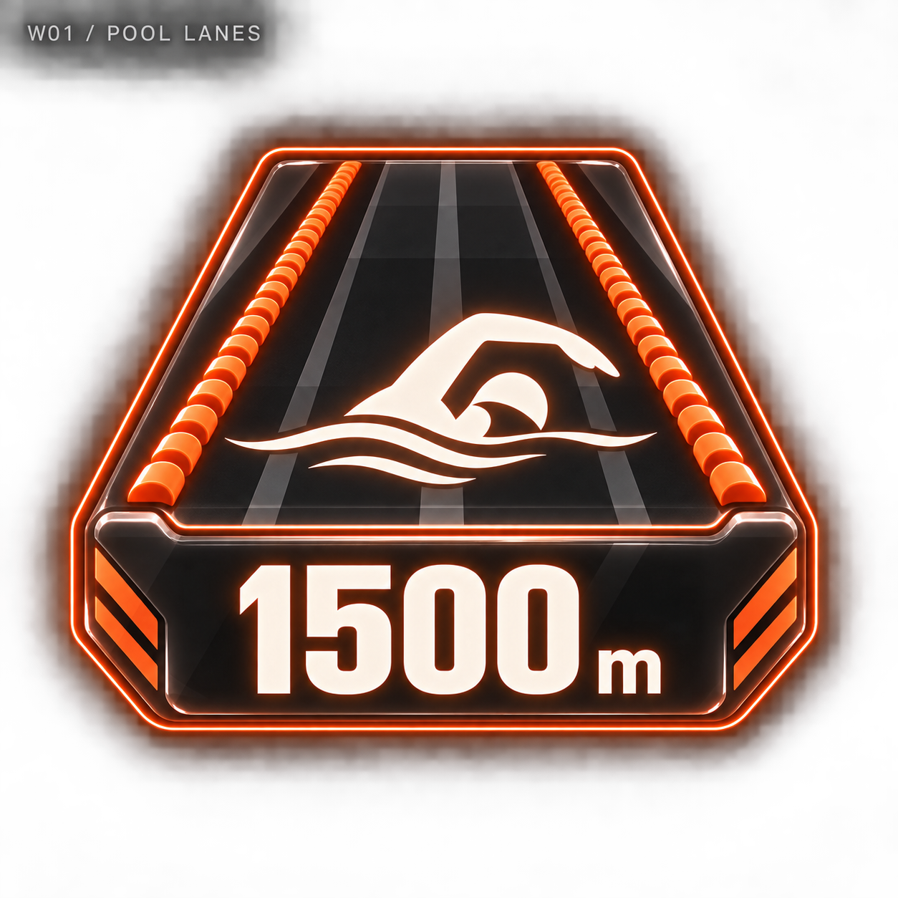
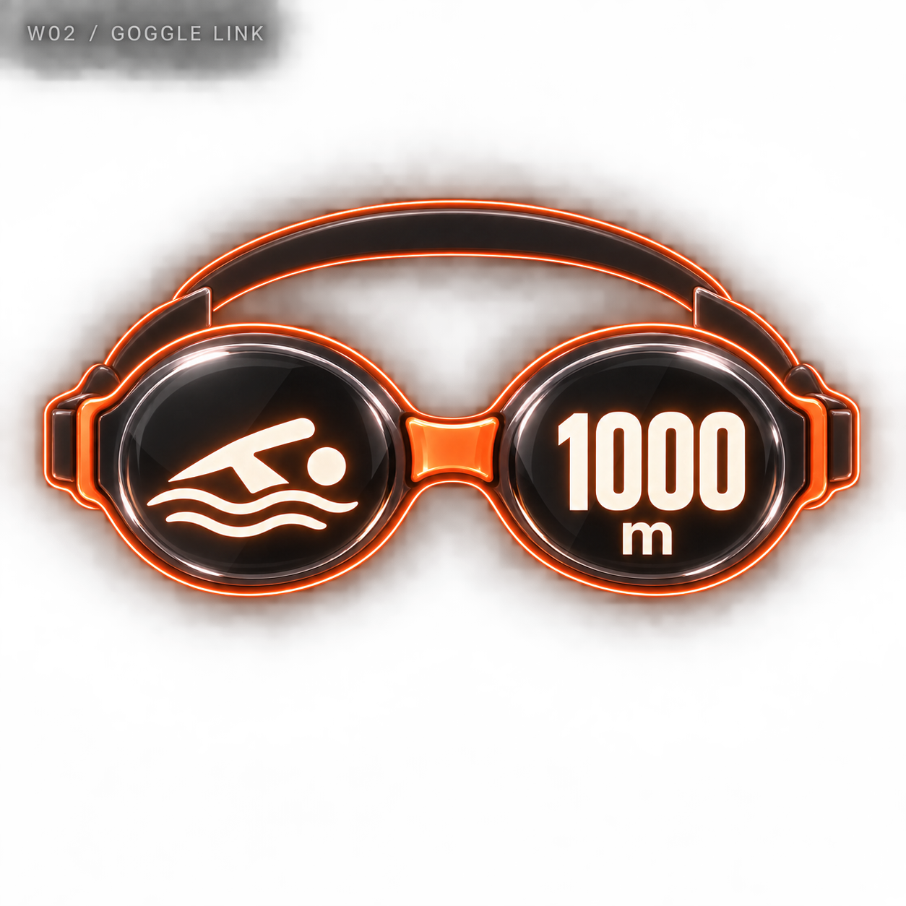
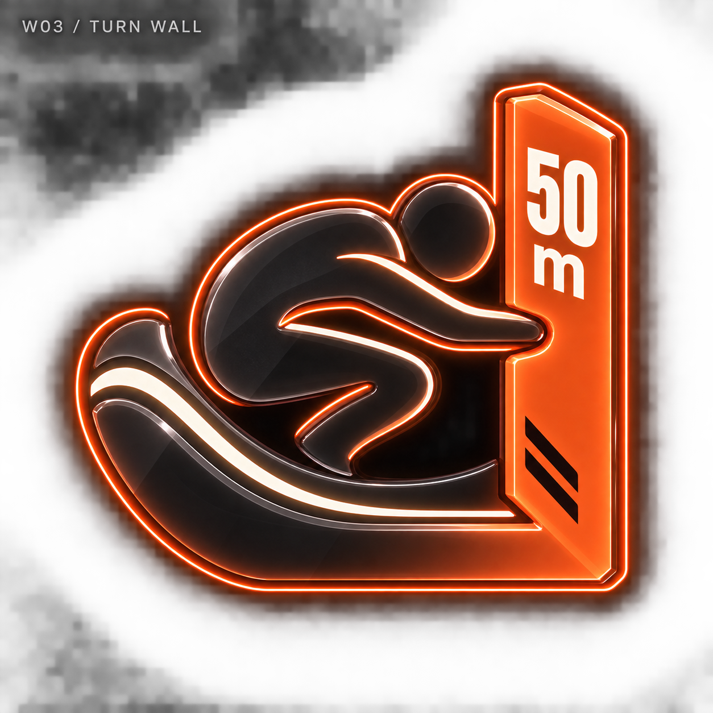
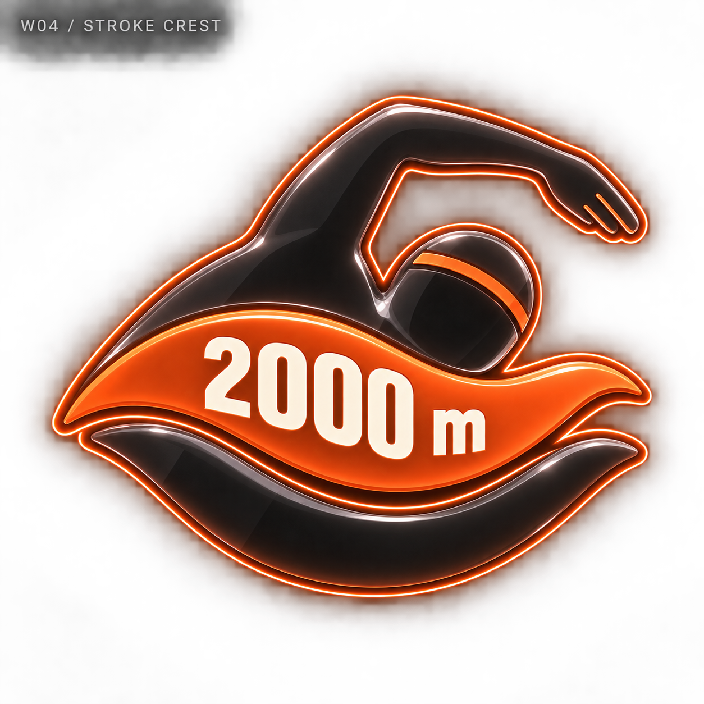
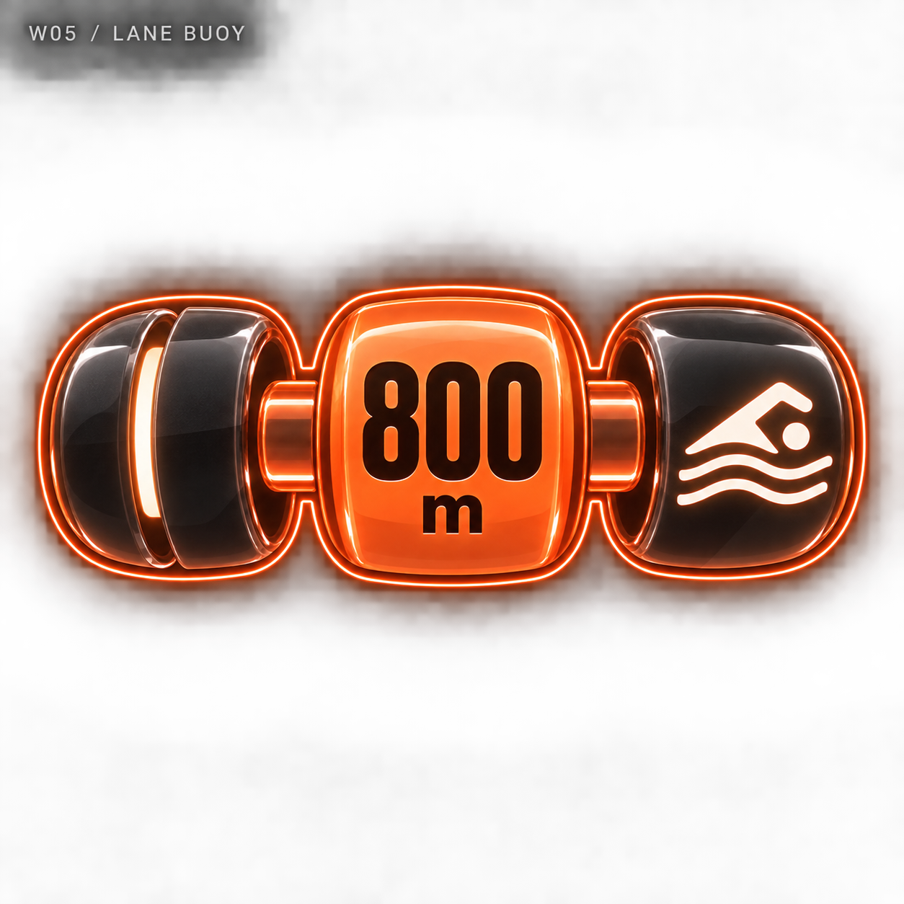
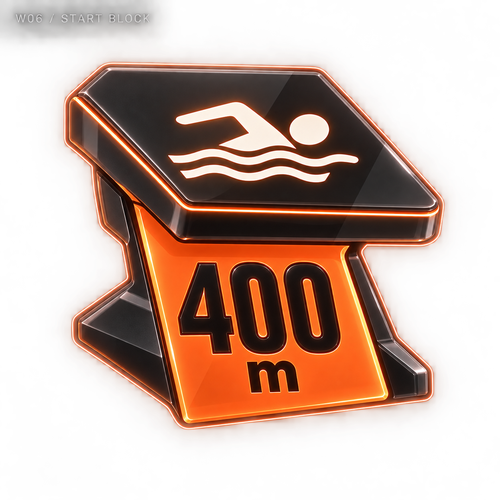
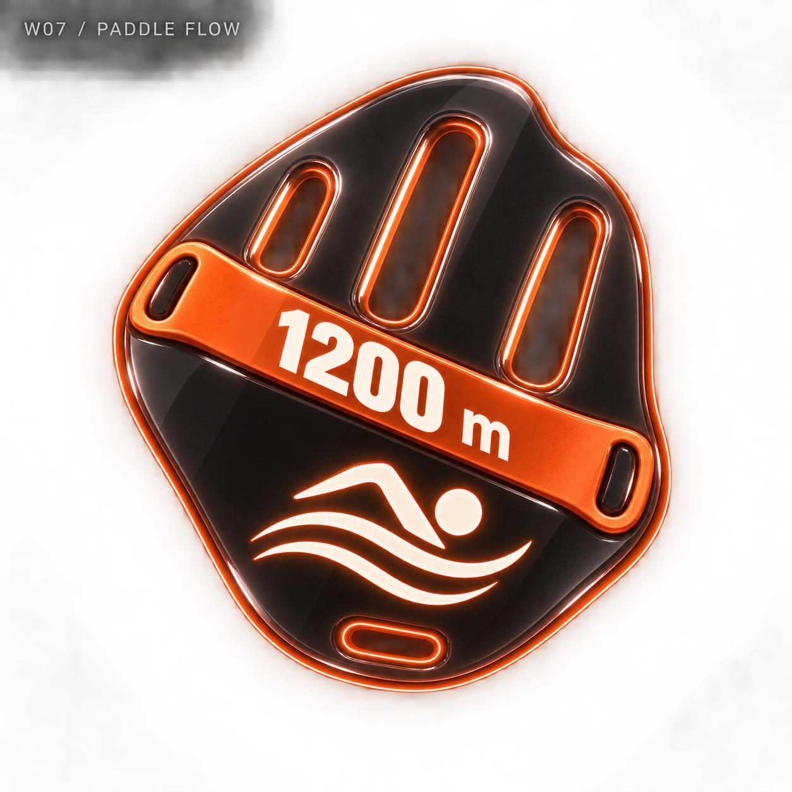
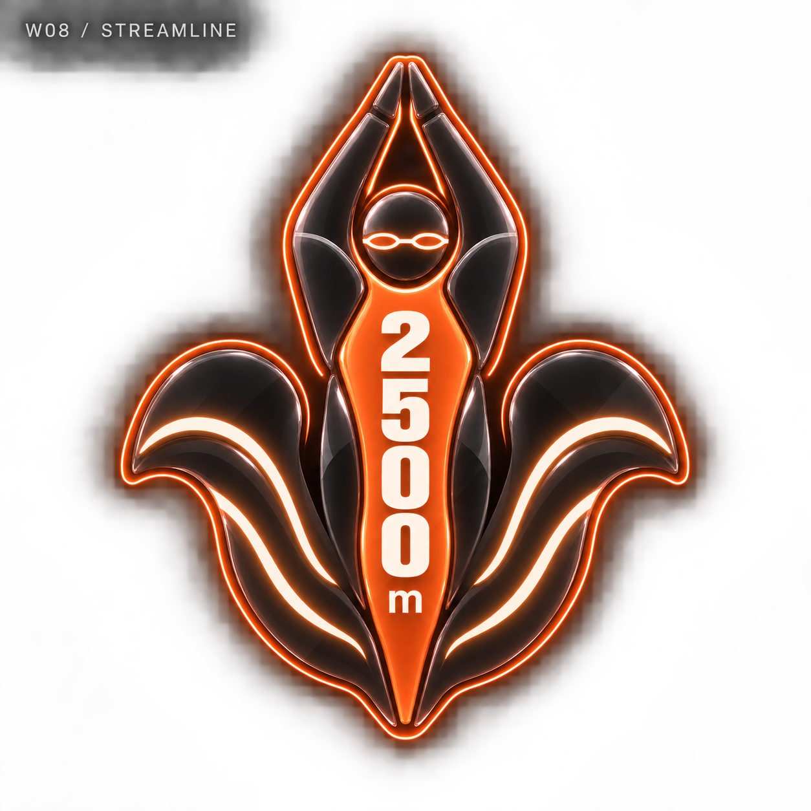
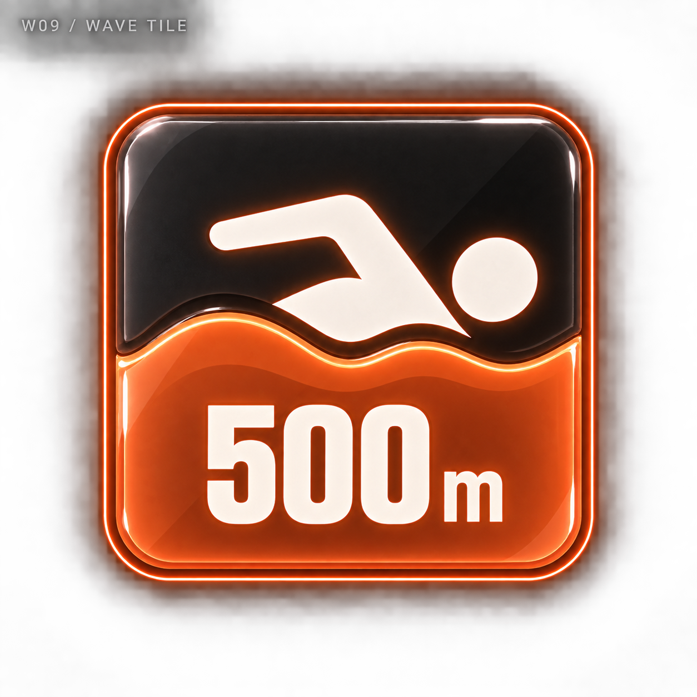
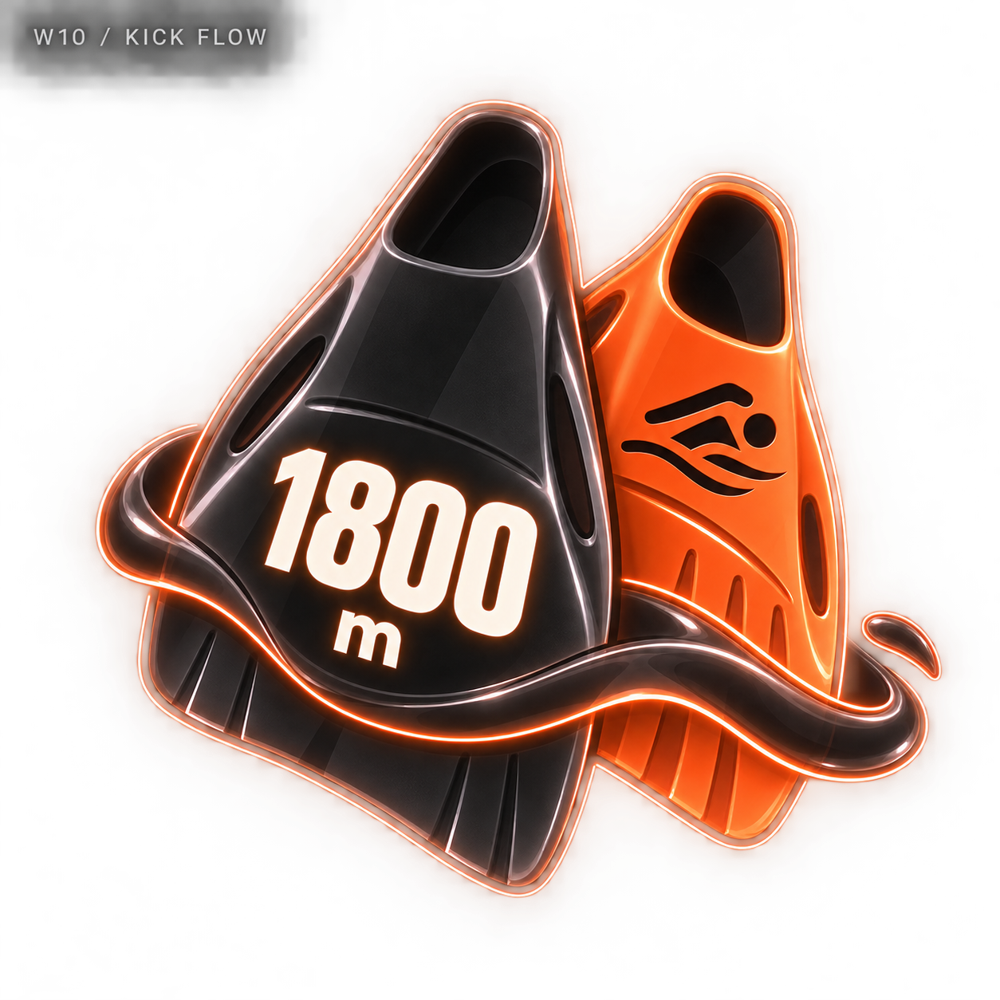

# 수영 네온 메달 — 10개 시안

관리자 디자인 보관함에 추가한 비교용 시안입니다. 기록 수치는 가상 예시이며 실제 메달 지급에는 적용하지 않았습니다.

[전체 종목으로](../README.md) · [생성 프롬프트](../prompts.json)

## W01 · 풀 레인 / POOL LANES

기록 예시: 1500 m

[원본 열기](w01-pool-lanes.png)

## W02 · 고글 링크 / GOGGLE LINK

기록 예시: 1000 m

[원본 열기](w02-goggle-link.png)

## W03 · 턴 월 / TURN WALL

기록 예시: 50 m

[원본 열기](w03-turn-wall.png)

## W04 · 스트로크 크레스트 / STROKE CREST

기록 예시: 2000 m

[원본 열기](w04-stroke-crest.png)

## W05 · 레인 부이 / LANE BUOY

기록 예시: 800 m

[원본 열기](w05-lane-buoy.png)

## W06 · 스타트 블록 / START BLOCK

기록 예시: 400 m

[원본 열기](w06-start-block.png)

## W07 · 패들 플로우 / PADDLE FLOW

기록 예시: 1200 m

[원본 열기](w07-paddle-flow.png)

## W08 · 스트림라인 / STREAMLINE

기록 예시: 2500 m

[원본 열기](w08-streamline.png)

## W09 · 웨이브 타일 / WAVE TILE

기록 예시: 500 m

[원본 열기](w09-wave-tile.png)

## W10 · 킥 플로우 / KICK FLOW

기록 예시: 1800 m

[원본 열기](w10-kick-flow.png)
